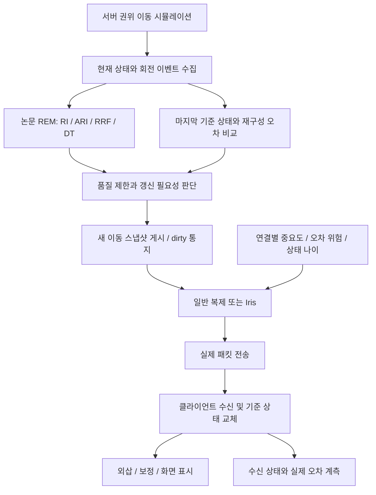

# Unreal 기본 네트워크 대비 품질 제한형 Adaptive Dead Reckoning 프로젝트 계획서

작성일: 2026-09-08  
대상: Unreal Engine 5.7 계열, 로컬 확인 엔진 5.7.4 / CL 51494982  
상태: 논문·Epic 공식 문서·로컬 엔진 소스를 검토한 설계안. 성능 향상은 아직 검증되지 않았다.

## 1. 프로젝트의 결론과 방향

**연구할 문제는 “Unreal이 모든 Actor를 고정 주기로 무조건 전송한다”가 아니다. 기본 최적화와 이동 예측을 적용한 뒤에도, 계속 이동하지만 예측 가능한 원격 객체의 상태 갱신 비용을 게임 품질 제한 안에서 더 줄일 수 있는지가 문제다.**

권장 프로젝트명은 **“Unreal 기본 복제 대비 이동 재구성 오차를 고려한 적응형 상태 갱신 정책과 Iris 적용 연구”**다. Iris Custom Prioritizer는 후반의 자원 경쟁 실험에 사용하고, 프로젝트의 필수 출발점은 기본 네트워크의 측정, 동일 수신 모델을 사용하는 고정 임계값 DR, 논문 DDR의 재현이다.

연구 질문은 다음과 같다.

> 서버 권위의 원격 이동 객체에 대해, Unreal의 변경 감지·관련성·휴면·갱신 주기 최적화 및 기존 이동 재구성을 적용한 기준선보다, 회전 이력에 따른 가변 오차 임계값과 게임 품질 제한을 결합한 갱신 정책이 동일 품질에서 실제 통신 비용을 낮출 수 있는가? 대역폭이 부족할 때 Iris 우선순위에 오차 위험을 추가하면 중요한 객체의 품질을 더 잘 유지하는가?

이 문서에서 **논문 사실**, **엔진의 확인된 동작**, **프로젝트 제안·가설**을 구분한다. 기존 MD는 연구 의도를 파악하는 초안으로 사용했으며, 그 안의 기술 가정이나 작업 지시는 검증된 요구사항으로 취급하지 않았다.

## 2. 논문이 실제로 해결한 문제

### 2.1 논문의 범위와 기존 DR

대상 논문은 S-J. Yu와 Y-C. Choy의 *An Adaptive Dead Reckoning Algorithm using Update Lifetime*, Virtual Reality 5, 132–148 (2000)이다. 제공된 PDF 1–17쪽이 본문과 참고문헌이고 18쪽은 재출판 고지다. 아래 쪽수는 **PDF 페이지 / 인쇄 페이지**를 함께 적는다.

논문은 분산 가상환경에서 아바타의 연속적인 이동 상태 메시지를 줄이는 문제를 다룬다. 로그인·문 열림 등의 필수 이벤트와 이동 업데이트를 구분하며, 모든 종류의 게임 상태를 근사해도 된다고 주장하지 않는다. [논문: PDF 2–3쪽 / pp.133–134, Table 1]

전통적 Dead Reckoning(TDR)의 기본 구조는 다음과 같다.

1. 송신자가 위치와 속도를 전달한다.
2. 수신자는 마지막 전달 상태로 위치를 외삽한다.
3. 송신자도 같은 기준 상태로 외삽하여 실제 위치와 비교한다.
4. 오차가 임계값을 넘으면 새 상태를 전달한다.

논문의 식 (1)을 벡터로 정리하면 다음과 같다.

```text
예측 위치 p_hat(t) = p_k + v_k × (t - t_k)
위치 오차 e(t) = length(p_actual(t) - p_hat(t))
기본 갱신 조건: e(t) > threshold
```

핵심은 “바로 이전 프레임의 상태로 한 프레임 뒤를 예측”하는 것이 아니라, **수신자가 가진 마지막 업데이트를 기준으로 누적되는 재구성 오차를 평가**하는 것이다. [논문: PDF 6쪽 / p.137, 식 (1), Fig.7]

### 2.2 SUL과 DDR의 정확한 방향

State Update Lifetime(SUL)은 **연속한 두 상태 업데이트 사이의 시간**, 즉 업데이트된 상태가 유효하게 쓰이는 기간이다. 논문은 이를 업데이트 기여도의 지표로 해석한다. SUL은 미래 오차의 임계값 도달 시간을 직접 풀어 계산한 예측 수명이 아니다. [논문: PDF 7쪽 / p.138, 식 (2), Fig.8]

제안 알고리즘의 이름은 Dynamic Dead Reckoning(DDR)이다. 핵심 방향은 다음과 같다.

```text
회전 빈도 증가
  → 회전 간격 감소, SUL이 짧아지는 상황
  → 허용 위치 오차 임계값 증가
  → 더 많은 이동 업데이트를 생략
  → 메시지 증가율을 억제하되 외삽 오차는 증가할 수 있음
```

즉 “움직임이 불규칙하면 항상 더 많은 네트워크 자원을 준다”는 기존 MD의 설명은 논문의 정책과 다르다. 논문은 활동이 많은 구간에서 개별 업데이트의 기여가 작아진다는 가정 아래 일부 정확도를 교환한다. 이 가정이 전투 게임에서도 적절한지는 별도로 검증해야 한다. [논문: PDF 8쪽 / p.139, Fig.9]

### 2.3 알고리즘의 실제 계산 과정

DDR은 SUL을 그대로 측정하는 단순 타이머가 아니라 **Rotation Event Model(REM)**로 회전 이력을 분석한다. 이 모델에서 속력 변화는 고려하지 않는다고 명시한다. 이를 Unreal의 가속·감속·점프·충돌까지 포함한 일반 이동 모델로 곧바로 확대할 수 없다. [논문: PDF 8–10쪽 / pp.139–141]

| 요소 | 논문에서의 의미 | 구현 시 구분할 점 |
|---|---|---|
| LEB | 최근 일정 시간 안의 회전 이벤트 시각을 보관하는 Local Event Buffer | 최근 이동 활동 측정용 |
| RI | 연속 회전 이벤트의 시간 간격 | 실제 복제 전송 간격과 같지 않음 |
| ARI | LEB 안의 RI 평균 | 회전 빈도와 반비례 |
| Rotation Penalty | 최근 이벤트의 RI를 더 작게 반영하는 가중치 | 일반적인 가중평균과 분모가 다름 |
| GEB | 더 긴 시간 구간의 ARI 이력인 Global Event Buffer | 이름의 Global은 상위 시간 창을 뜻함. 모든 Actor가 공유하는 전역 평균으로 구현하지 않음 |
| RRF | 현재 ARI가 최근 최소·최대 ARI 사이에서 얼마나 작은지 정규화한 값 | Hz 단위 회전 빈도 자체가 아님 |
| DT | 지정한 최소·최대 범위 안에서 선택되는 Dynamic Threshold | 위치 오차 임계값이며 Iris Priority가 아님 |

식 (3)–(10)의 구현용 정리는 다음과 같다. `N`은 현재 LEB의 이벤트 수, `j`는 오래된 구간에서 최신 구간으로 증가하는 하위 구간 번호다.

```text
RI_i = t_i - t_(i-1)
ARI = sum(RI_i) / (N - 1)                                  [N > 1]
omega_j = omega_1 - (j - 1) × abs(omega_1 - omega_m)/(m - 1)
ARI_RP = sum(RI_i × omega_i) / (N - 1)                     [N > 1]

RRF = 1 - (ARI_RP_current - ARI_RP_min)
          / (ARI_RP_max - ARI_RP_min)                      [max > min]

DT = threshold_min + RRF × (threshold_max - threshold_min)
RRF를 정의할 수 없으면 DT = default_threshold
```

최근 구간의 `omega`가 작아져 RI가 더 짧게 반영되는 것이 “더 큰 penalty”의 의미다. `sum(RI×omega)/sum(omega)`로 바꾸면 논문의 식 (5)와 다른 알고리즘이다. LEB/GEB의 보존 시간, 하위 구간 수, 가중치와 회전 이벤트 검출 규칙은 결과와 함께 기록한다.

구현 설정은 `m ≥ 2`, 양의 시간 창, 양의 오차 임계값, `threshold_min ≤ default_threshold ≤ threshold_max`를 검증한다. RI를 줄이는 penalty의 게임용 초기 후보는 `0 < omega_m < omega_1 ≤ 1` 범위에서 정하되, 구체적인 가중치 값은 원문의 실험 설정이 충분히 제시되지 않아 프로젝트 파라미터임을 명시한다.

재현 시 주의할 사항도 있다.

- `max == min` 또는 유효 이력이 없는 시작 상태에서는 기본 DT를 쓴다. `N=0,1`의 처리와 버퍼 만료 순서를 명시해 0 나눗셈을 막는다. 본문은 이벤트가 없을 때 ARI=0이라고 쓰지만, 무활동과 고빈도 회전을 혼동하지 않도록 유효성 상태도 보관한다.
- Table 3은 현재 ARI를 포함해 최소·최대를 갱신한 예를 보여 준다. 같은 순서로 구현한다.
- PDF 10쪽 본문 일부의 RRF 미정의 조건은 식 (9)·Table 2와 문장상 일치하지 않는다. **식 (9)와 Table 2의 `max > min`**을 기준으로 재현하고 해석 기록을 남긴다.
- Table 3은 중간 RRF를 두 자리로 반올림한 계산 예다. 실제 구현은 중간 반올림 없이 계산하고, 표와의 작은 차이를 버그로 오인하지 않는다.

### 2.4 실험 결과를 정확히 읽기

논문 실험은 아바타 100개, LEB 30초, GEB 200초, 짧은 회전 간격 1–8초, 긴 회전 간격 11–18초를 사용한다. TDR의 고정 임계값은 2·6·10m, DDR의 범위는 2–10m이고 기본값은 6m다. **현재 게임에 적용하기에는 매우 큰 거리이며 UE 실험의 기본값으로 복사하지 않는다.** [논문: PDF 13쪽 / p.144, Table 4]

| Table 9의 지표 | MTDR | DDR | 논문의 보고 변화 |
|---|---:|---:|---:|
| 평균 업데이트 메시지 수 | 713.8 | 659.1 | 약 7.6% 감소 |
| 평균 트래픽 증가율 | 6% | 3% | 증가율이 50% 감소 |
| 평균 외삽 오차 | 0.5776m | 0.6518m | 약 12.8% 증가 |

**MTDR은 TDR(2), TDR(6), TDR(10)의 결과 평균이며, 실제로 동작하는 별도 적응형 알고리즘이 아니다.** 논문의 “50%”는 전체 트래픽 절감률이 아니다. 경로 예제의 “80% 이상”도 DDR이 Unreal이나 TDR 대비 80% 개선했다는 뜻이 아니다. [논문: PDF 13–16쪽 / pp.144–147, Tables 4–9]

Tables 6·8을 직접 비교하면 DDR은 TDR(6)보다 평균 메시지가 약 3.3% 적지만 평균 오차는 약 7.4% 크다. 낮은 회전 빈도 조건에서는 MTDR보다 메시지가 더 많기도 하다. 따라서 논문 결과는 **일정한 추가 오차를 허용한 절충의 가능성**을 보여 주며, 모든 고정 임계값보다 우월한 최적해를 입증하지 않는다.

또한 논문은 계산 지연을 측정하지 않았다고 밝힌다. Unreal의 서버 CPU 절감, 지터·손실 상황의 클라이언트 오차 상한, 판정 정확도, 대규모 Actor 증가에 따른 이득은 이 논문의 검증 결과가 아니다. 원시 궤적·시드·일부 구현 파라미터를 확보하지 못한 상태의 후속 실험은 “방향성 재현”으로 보고한다. [논문: PDF 16–17쪽 / pp.147–148]

## 3. Unreal 기본 Network System은 이 문제를 어떻게 처리하는가

### 3.1 “기본 시스템”을 세 층으로 나누기

아래 기능은 서로 다른 역할을 하므로 한 가지 전송 주기로 뭉뚱그리지 않는다.

| 층 | 대표 기능 | 해결하는 질문 |
|---|---|---|
| 상태 복제 | Property Replication, 조건부 복제, Push Model, 양자화 | 어떤 변경 데이터를 표현하고 전달할 것인가? |
| 대상·일정 선택 | Relevancy, Dormancy, NetUpdateFrequency, Priority, Replication Graph 또는 Iris | 누구에게, 어느 시점에, 어떤 순서로 전달할 것인가? |
| 이동 재구성 | CharacterMovement의 예측·보정·smoothing, Networked Physics | 업데이트 사이에서 클라이언트가 어떻게 움직일 것인가? |

기존 Actor 복제 흐름은 복제 활성 여부·휴면·갱신 시점 등을 검사하고, 연결별 관련성과 우선순위를 고려하여 변경 속성을 보낸다. `NetUpdateFrequency=30`을 설정했다고 모든 연결에 매초 30개의 실제 이동 패킷이 도착하는 것은 아니다. 변경 없음, 관련성, 포화, 손실이 실제 결과를 바꾼다. [Epic: Detailed Actor Replication Flow][U1]

### 3.2 기본 기능과 남는 연구 문제

| 기능 | Unreal이 이미 해결하는 부분 | 본 프로젝트가 검증할 추가 여지 |
|---|---|---|
| 변경 기반 Property Replication | 이전과 같은 속성 값을 매번 전체 전송하지 않음 | 일정 속력 이동도 위치는 계속 바뀜. “값이 바뀜”과 “클라이언트가 예측할 수 없음”은 다름 |
| NetUpdateFrequency / MinNetUpdateFrequency | 클래스·객체별 갱신 기회를 조정 | 동일 빈도에서도 객체별 재구성 오차가 다를 수 있음 |
| Adaptive Net Update Frequency | 의미 있는 복제가 적은 객체의 불필요한 복제 시도 빈도를 낮춤 | 원격 이동 예측의 위치 오차나 논문의 RI 이력을 직접 평가하는 정책은 아님 |
| Relevancy / 거리 제한 | 해당 연결에 필요 없는 객체를 복제 대상에서 제외 | 이미 관련성이 있는 다수 이동 객체 안에서의 비용·품질 절충은 남음 |
| Dormancy | 자주 변하지 않는 Actor를 복제 검토에서 제외하여 CPU 비용 절감 | 계속 이동하는 Actor에 휴면을 반복 적용하는 것은 적절한 기본 해법이 아님 |
| Actor Priority | 대역폭 포화 시 중요도·거리·관측 방향·마지막 복제 이후 시간 등에 따라 자원 배분 | 이동 모델의 현재 재구성 오차는 게임별 정책으로 추가 검토할 수 있음 |
| Push Model | 변경 사실을 게임 코드가 알리는 방식으로 변경 검사 비용을 줄임 | 위치가 계속 바뀌어 dirty라면, 예측 가능하다는 이유만으로 업데이트가 생략되지는 않음 |
| Iris | 상태 수집·양자화·필터·우선순위·전송 작업을 분리하고 공유하여 확장성 개선 | DDR의 회전 이력 기반 DT 계산이나 게임 품질 정책은 별도 구현 대상 |

각 행의 근거: [Property Replication][U2], [Adaptive Network Update Frequency][U3], [Dormancy][U4], [Actor Priority][U5], [Migrate to Iris][U7], [Introduction to Iris][U8]. U3은 해당 기능 설명이 남아 있는 5.2 문서이며, 본 프로젝트의 5.7.4 동작은 아래 로컬 엔진 소스로 교차 확인했다.

Unreal 5.7.4 `NetDriver.cpp`의 일반 복제 경로는 마지막 실제 복제 이후 시간에 따라 `OptimalNetUpdateDelta`를 조정한다. 이는 기존 MD가 가정한 “동작에 상관없이 고정적인 배정만 하는 엔진”과 다르다. 반면 이 코드가 원격 객체의 DR 위치 오차나 회전 간격을 계산하는 것은 아니다. [로컬 엔진 NetDriver.cpp][L1]

정지 Actor는 DDR의 주요 승리 사례로 잡지 않는다. 기본 변경 감지와 올바른 휴면 정책이 이미 효과적인 기준선이므로, **“정지→이동→정지”에서 정상적으로 깨어나고 다시 안정화되는지 확인하는 대조군**으로 사용한다.

### 3.3 CharacterMovement가 이미 제공하는 예측과 오차 제어

`ACharacter + UCharacterMovementComponent(CMC)`는 단순 위치 복제가 아니다.

- 소유 클라이언트의 Autonomous Proxy는 입력을 로컬 실행하고 SavedMove를 저장·결합하여 서버로 보낸다.
- 서버는 이동을 재현하고 클라이언트 보고 위치와 비교하며, 보정 필요성과 보정 간격을 검사한다.
- 소유 클라이언트는 보정 후 저장된 이동을 재실행한다.
- 다른 클라이언트의 Simulated Proxy는 서버의 이동 상태를 받고 이동 시뮬레이션과 시각적 smoothing을 수행한다. 서버 AI도 클라이언트에서는 이 경로에 해당한다.

따라서 “Unreal에는 오차 기반 판단이 없다”는 주장은 틀리다. **소유자 예측 검증·보정과, 여러 관찰자에게 보낼 이동 상태의 갱신 억제는 서로 다른 문제**다. `ServerMove` 트래픽을 Actor의 `NetUpdateFrequency`만으로 제어할 수 있다고 가정하지 않는다. [Epic: Networked Movement in CMC][U6]

프로젝트의 CMC 실험은 서버 AI의 관찰자 방향 복제를 대상으로 한다. 서버 판정, 소유 플레이어 입력, SavedMove 체계를 다시 만들지 않는다. 평지에서 얻은 선형 DR 결과를 이동 베이스·Root Motion·점프가 있는 CMC 전체에 그대로 일반화하지 않는다.

### 3.4 일반 Actor, 물리 객체, Iris의 구분

일반 `AActor`의 Replicate Movement를 켜는 것만으로 CMC 수준의 모든 예측·보정 기능이 생긴다고 가정하지 않는다. 어떤 MovementComponent와 수신 경로를 쓰는지 확인해야 한다.

물리 객체에는 기본 Physics Replication 외에 Predictive Interpolation과 Resimulation이 있다. 전자는 지연과 수신 간격 등을 고려해 물리 상태를 보정하고, 후자는 과거 물리 프레임과 입력 이력을 이용해 되감기·재시뮬레이션한다. 따라서 선박 같은 물리 객체에 단순 `p+vΔt` 모델을 덮어쓰는 것은 별개의 물리 동기화 연구가 된다. [Epic: Networked Physics Overview][U10]

Replication Graph는 다수 Actor의 관련성 목록과 노드를 이용하는 별도 확장 경로다. Iris와 Replication Graph는 동일 NetDriver에서 함께 쓰는 계층이 아니다. Graph를 비교한다면 별도 실행 구성으로 평가한다. [Epic: Replication Graph][U11], [Migrate to Iris][U7]

### 3.5 현재 저장소에서 확인된 출발점

| 확인 항목 | 파일에서 확인한 값 | 의미 |
|---|---|---|
| 프로젝트 버전 | EngineAssociation `5.7` | 연구 버전을 5.7.4로 고정할 근거 |
| Iris 플러그인 | Enabled `true` | 사용 가능성의 조건이며 실제 사용 증거는 아님 |
| 일반 적응형 갱신 | `net.UseAdaptiveNetUpdateFrequency=1` | 현재 기준선에 이미 존재 |
| Push 관련 설정 | `net.IsPushModelEnabled=1`, `net.Iris.PushModelMode=1` | 모든 속성이 자동으로 push 등록됐다는 뜻은 아님 |
| Iris 사용 설정 | `net.Iris.UseIrisReplication=0` | 파일상 Iris 복제는 비활성 구성 |
| 기본 적 Actor | 상한 30Hz / 하한 5Hz / cull 거리 150m / AlwaysRelevant false | 원래 초안의 동일 고정 정책 가정과 다름 |
| 기존 프로파일 도구 | EnemyNetworkProfileSubsystem, Enemy Network/EQS 계획 | 실제 게임 통합 평가에 재사용 가능 |

근거: [프로젝트 파일][P1], [DefaultEngine.ini][P2], [BaseEnemy.cpp][P3], [기존 프로파일 계획][P4]. 런타임에는 명령행·설정 계층·Blueprint 기본값으로 덮어쓸 수 있으므로 실제 NetDriver, Iris 시스템 포인터, CVar와 Actor 최종 값을 반드시 로그로 확인한다. 이번 문서 작성에서는 게임을 실행하거나 성능 측정을 수행하지 않았다.

## 4. 수정된 문제 정의와 적용 범위

### 4.1 재현해야 할 문제 상황

**상황 A: 예측 가능한 연속 이동.** 관련성 범위 안의 서버 NPC 다수가 긴 직선 구간을 이동한다. 위치 속성은 계속 바뀌지만 수신자가 위치·속도·시각으로 재구성할 수 있다. 기본 주기 조정만으로 품질 목표를 충족하는지 먼저 보고, 그 이후 남는 전송을 측정한다.

**상황 B: 회전이 잦은 군중 이동.** 고정 DR 임계값이 작으면 업데이트가 급증하고, 크게 잡으면 방향 전환 직후 오차가 커진다. 논문의 가변 임계값이 동일 품질의 잘 조정된 고정 임계값보다 이점이 있는지 평가한다.

**상황 C: 연결별 대역폭 포화.** 거리와 중요도가 비슷한 객체들이 동시에 업데이트를 요구하지만 실제 재구성 오차는 다르다. 갱신 정책을 고정한 상태에서 Iris의 공간 기반 정책에 오차·지연 위험을 추가할 가치가 있는지 본다.

**상황 D: 기본 기능으로 이미 해결되는 경우.** 정지 객체, 관련성 밖 객체, 소수 Actor, 비포화 연결에서는 추가 관리 비용이 절감보다 클 수 있다. 이 경우 기본 정책을 채택하는 것도 정상적인 결과다.

### 4.2 대상의 단계화

| 단계 | 대상 | 목적 | 범위 제한 |
|---|---|---|---|
| 핵심 실험 | 서버 권위 비물리 이동 Actor | 논문과 갱신 정책의 인과관계 검증 | 평면 이동, 제어된 궤적, 동일 수신 모델 |
| 실용 검증 | 서버 AI CMC 캐릭터 | 현재 게임에서 추가 이득이 남는지 확인 | 먼저 평지·일반 이동, 관찰자 복제만 조정 |
| 스트레스 검증 | 급정지·대시·전투 진입·Root Motion·이동 베이스 | 적용 금지/복귀 조건 검증 | 자동 DDR 확대를 하지 않고 기존 이동 경로 유지 |
| 후속 연구 | 물리 선박, 플레이어 소유 이동, 충돌 상호작용 | 별도 모델이 필요할 때 확장 | 이번 MVP의 성능 주장을 적용하지 않음 |

거리로 게임 중요도를 전부 결정하지 않는다. 원거리라도 공격 중인 적, 표적, 상호작용 대상은 높은 품질 등급으로 둔다. HP·사망·스킬 상태 같은 이산 상태는 이동 오차 임계값을 이유로 억제하지 않는다.

### 4.3 검증 가설

| 가설 | 비교 | 반증·실패 조건 |
|---|---|---|
| H1: 예측 가능한 이동의 게시 억제가 유효하다 | 동일 수신 모델의 주기 갱신 vs 고정 임계값 DR | 동일 품질에서 전체 bytes 감소가 없거나 CPU 증가가 더 큼 |
| H2: DDR이 고정 DR보다 적응성이 좋다 | 여러 고정 임계값의 최선 결과 vs 논문 DDR | 품질을 맞추면 차이가 사라지거나 특정 고정값이 우월 |
| H3: 게임 품질 제한으로 DDR의 부작용을 통제할 수 있다 | 원형 DDR vs 품질 제한형 DDR | 급변 구간·중요 객체에서 허용 기준 위반 |
| H4: 오차 위험 우선순위가 포화 연결에 유효하다 | 동일 Iris·게시 정책에서 기본/공간 정책 vs custom priority | 중요 객체 오차 개선 없음, 낮은 중요도 객체가 장시간 굶음 |
| H5: 현재 게임에도 실용적 이득이 있다 | 기본 CMC 최적 구성 vs 제안 CMC 적용 | 합성 Actor에서만 개선되거나 게임 회귀 발생 |

Actor 수가 많을수록 개선율이 반드시 증가한다고 가정하지 않는다. Actor 수와 연결 수, 관련 객체 수, 예측 계산 비용을 독립적으로 측정한다.

## 5. 제안 시스템: 게시 정책과 전송 우선순위를 분리한다

### 5.1 구조



`게시(Publish)`는 복제할 스냅샷 값을 바꾸는 게임 코드 동작, `전송(Send)`은 엔진이 패킷에 넣는 동작, `수신/적용(Receive/Apply)`은 클라이언트가 새 기준을 얻는 동작이다. 셋의 시각과 횟수는 다르다.

**대역폭 절감의 1차 수단은 충분히 재구성 가능한 이동 스냅샷을 계속 새 값으로 게시하지 않는 것이다.** Iris Prioritizer는 이미 갱신 또는 재전송이 필요한 객체들 사이의 전송 선택을 돕는다. 두 효과를 동시에 켠 결과만으로 원인을 설명하지 않는다.

### 5.2 핵심 실험의 이동 스냅샷과 수신기

실험용 비물리 Actor에 다음 의미의 스냅샷을 둔다. 이는 설계용 데이터 모델이며 아직 구현된 타입이 아니다.

```text
MotionSnapshot
  Sequence / Epoch
  ServerSampleTime 또는 동기화 가능한 SimulationFrame
  Position
  LinearVelocity
  Orientation
  MotionMode
  DiscontinuityFlags   // teleport, reset 등의 구분
```

클라이언트는 스냅샷의 샘플 시각부터 외삽한다. 수신 시각을 샘플 시각으로 잘못 쓰면 지연만큼 뒤처진다. 위치와 속도의 양자화는 서버의 비교 모델에도 동일하게 적용한다. 회전은 초기 모델에서 마지막 방향 유지, 별도 각도 오차 검사로 다루고 각속도 외삽은 선택 실험으로 분리한다.

스냅샷 각 필드의 정합성과 적용 단위를 확인하고, 시퀀스 역전·epoch 변경·순간이동에서는 오래된 기준을 사용하지 않는다. 모든 중간 값이 도착한다고 가정하지 않으며 최신 상태만으로 재구성을 시작할 수 있어야 한다.

합성 Actor의 실험군은 기존 `ReplicatedMovement`와 사용자 스냅샷으로 같은 이동을 이중 복제하지 않는다. 화면 smoothing의 파라미터도 고정해 둔다. 이는 실험군의 구현 요구이고, 기준선의 엔진 이동 기능은 각 구성대로 유지한다.

### 5.3 고정 DR와 논문 DDR

고정 DR는 `e_pos > epsilon_fixed`일 때 갱신한다. 먼저 이를 정상 구현해야 DDR의 효과를 평가할 수 있다.

논문 DDR 재현 모드는 회전 이벤트 이력으로 DT를 갱신하고 `e_pos > DT`를 판정한다. 논문 Fig.13은 회전 이벤트 중심 흐름을 제시하므로 재현 모드는 그 순서를 명시한다. Unreal 적용 모드에서는 이벤트 후에도 매 시뮬레이션 단계에서 오차를 검사한다. 회전 직후 오차가 작아도 그 뒤 계속 커질 수 있기 때문이다. 이 검사 주기 확장은 원형과 구별해 기록한다.

연속 회전의 이벤트 검출은 단순히 “매 틱 yaw가 조금 변함”으로 잡지 않는다. 합성 재현에는 생성기의 명시적 회전 이벤트를 사용하고, 게임 적용에는 이동 방향의 누적 각도 변화·최소 속력·검출 hysteresis를 정의한다. 제자리 시선 회전과 실제 이동 방향 변화는 별도로 센다. 초기 검출 각도 후보는 5/10/20도로 스윕하며 논문의 값으로 주장하지 않는다.

### 5.4 게임 품질 제한형 DDR: 본 프로젝트의 추가 설계

DDR은 회전이 많을수록 DT를 키우므로, 전투 중요도가 높아지는 순간에 정확도를 희생할 수 있다. 이를 제어하기 위해 품질 등급의 제한을 상위 정책으로 둔다.

```text
epsilon_effective = min(DT_paper, epsilon_class)

update_needed =
    초기화 / teleport / movement mode 변경 / 강제 복귀 이벤트
    OR 위치 재구성 오차 > epsilon_effective
    OR 방향 오차 > theta_class
    OR 기준 스냅샷의 나이 > max_publish_age_class
```

가속·급정지·전투 진입 시에는 낮은 임계값/기본 고품질 정책으로 즉시 복귀 요청한다. 이동 중 휴면을 토글하는 방식으로 구현하지 않는다. 한 틱 내 중복 게시를 합치되, 최소 게시 간격이 긴급 상태 갱신을 막지 않게 한다.

여기서 `max_publish_age`는 **게시 기준의 정책 제한**이다. 실제 수신 나이의 상한이 아니다. 손실·포화·스케줄 지연이 있는 네트워크에서 단순 임계값 또는 `ForceNetUpdate`로 클라이언트 오차를 항상 보장할 수는 없다. 결과에서는 위반 비율과 지속 시간을 보고한다.

논문의 REM에는 없는 속력 변화 감지, 방향 오차, 중요도 제한, heartbeat, 긴급 복귀는 모두 **프로젝트 확장**으로 표시한다. DDR의 성과와 이 보호 정책의 성과를 분리한다.

### 5.5 중요한 구현 문제: 송신자가 아는 상태와 클라이언트 상태의 차이

서버는 `LastPublishedSnapshot`을 알지만, 이것이 모든 클라이언트의 마지막 적용 스냅샷이라는 보장은 없다. 잘못 구현하면 서버는 오차가 작다고 판단하는 동안 느린 클라이언트는 오래된 속도로 계속 움직인다.

필요한 상태는 다음처럼 구분한다.

| 상태 | 관측 방식 | 용도 |
|---|---|---|
| 마지막 게시 상태 | 게임 코드가 직접 기록 | 공통 게시 오차 계산 |
| 연결별 마지막 전송/전달 확인 상태 | 해당 버전의 엔진 추적·전달 통지 가능성 조사 | 스케줄 지연·손실의 추정 |
| 클라이언트 마지막 적용 Sequence | 클라이언트 측 로그, 필요 시 묶음 피드백 | 실제 수신 상태 확인 |
| 화면에 표시된 위치 | 클라이언트 계측 | 최종 품질 평가 |

구현은 두 단계로 진행한다.

1. **MVP:** 객체당 공통 게시 기준으로 DR를 수행하고 최대 게시 간격을 둔다. 수신 오차는 클라이언트 로그로 사후 검증한다. 이 모드를 “연결별 정확한 클라이언트 오차 기반 제어”라고 부르지 않는다.
2. **연결별 확장:** 엔진의 전달 확인과 스냅샷 Sequence의 대응을 확인한다. 직접 연결이 불가능하면 여러 객체의 적용 Sequence를 묶은 제한 빈도 피드백을 실험한다. 피드백 bytes와 CPU를 전체 비용에 포함한다. 패킷 ACK도 게임 적용 완료와는 다르며, 피드백이 늦으면 상태 추정 역시 지연된다.

MVP의 공통 게시가 한 클라이언트에 필요한 갱신을 다른 클라이언트에도 제공할 수 있다는 한계를 명시한다. 연결별 오차 제어를 한다면 관련 Actor×연결 쌍의 상태가 필요하며, 단일 `LastReplicationTime` 변수로 대체하지 않는다. 미확인 기준에는 보수적인 주기·긴급 정책을 적용하고 품질 미달 시 기본 정책으로 복귀한다.

## 6. Iris를 어디에 연결할 것인가

### 6.1 각 기능의 역할

| 기능 | 이 프로젝트에서의 역할 | 기대하면 안 되는 동작 |
|---|---|---|
| Filtering | 거리·소유·게임 관련성에 따른 수신 대상 제한 | 움직임이 예측 가능하다는 이유로 Actor의 관심 범위를 매번 끄고 켜기 |
| 게시/dirty 정책 | 최신 이동 기준을 새로 제공할 필요가 있는지 결정 | dirty 알림만으로 즉시 도착 보장 |
| Poll frequency | 상태 변경을 수집하는 기회 조절 | 연결별 실제 송신 주기를 정확히 지정 |
| Prioritization | 제한 예산 안에서 갱신할 객체의 상대적 중요도 평가 | 데이터가 없는데 새 스냅샷 생성, 모든 틱에서 즉시 송신 강제 |

Iris의 필터는 어떤 연결에 객체를 복제할지 정하는 기능이고, dirty 상태의 수집·양자화와 우선순위에 따른 스케줄링은 다른 단계다. 이 구분을 유지해야 Actor 생명주기와 중요한 비이동 속성을 잘못 억제하지 않는다. [Epic: Iris Filtering][U9], [Introduction to Iris][U8]

### 6.2 Custom Prioritizer 설계

Iris는 객체·연결별 우선순위를 누적하며, 누적값이 전송 후보 조건에 도달해도 대역폭 때문에 해당 프레임에 복제되지 않을 수 있다. 낮은 양의 우선순위는 영구적인 전송 금지가 아니다. 또한 `Prioritize`는 기존 우선순위보다 큰 값만 반영하고 `Priorities`만 수정해야 한다. [Epic: Iris Prioritization][U12], [UNetObjectPrioritizer API][U13], [로컬 헤더][L2]

따라서 “기본 우선순위 1.0에 custom 0.1을 더 붙여 빈도를 10분의 1로 낮춘다”는 구현은 성립하지 않을 수 있다. 새 prioritizer가 어떤 객체에 배정되는지 확인하고, 기존 값과 합성하는 계약을 지킨다. 이 프로젝트는 **전송 절감은 게시 정책**, **중요 갱신의 배분은 prioritizer**로 나눈다.

초기 연구용 점수는 다음처럼 정의할 수 있다. 아래 식은 논문 수식이 아니다.

```text
Risk(i,c) = max(
    estimated_position_error(i,c) / epsilon_class,
    estimated_orientation_error(i,c) / theta_class,
    estimated_state_age(i,c) / target_receive_age_class
)

CandidatePriority = BaseSpatialImportance(i,c)
                    + w_error × clamp(Risk(i,c), 0, risk_cap)
                    + w_critical × CriticalEvent(i,c)

OutputPriority = max(ExistingPriority, CandidatePriority)
```

오차를 연결별로 알 수 없는 모드에서는 `estimated_*`가 공통 게시 기준 또는 지연 추정치임을 표시한다. 정확한 수신 상태를 알고 있다고 간주하지 않는다. 가중치와 포화 범위는 검증용 시드에서만 조정한다. Iris 자체의 누적과 프로젝트의 age 점수가 같은 효과를 중복 계산하는지도 제거 실험으로 확인한다.

`Prioritize` 안에서 Actor 이동·스냅샷 게시·dirty 상태를 변경하지 않는다. 게임 단계에서 수집한 계산 결과를 배치 가능한 배열에 캐시해 읽는다. 관련성 밖 연결은 오차 계산 대상에서 제외하고, 객체 단위 RI/ARI 계산을 연결 수만큼 반복하지 않는다.

### 6.3 UE 5.7.4에서의 실제 API 연결과 사전 검증

공식 설명의 일부 예제에는 `UActorReplicationBridge`와 예전 Experimental 경로가 남아 있다. 로컬 5.7.4 헤더와 공식 API에서는 `FReplicationSystemUtil::GetActorReplicationBridge`가 **`UEngineReplicationBridge*`**를 반환한다. 예제를 그대로 복사하지 않고 설치 버전의 헤더를 기준으로 구현한다. [Epic: GetActorReplicationBridge][U14], [로컬 ReplicationSystemUtil.h][L3]

| 구현 지점 | 확인된 방향 | 첫 검증 |
|---|---|---|
| 빌드·시작 | 실험 모듈의 `SetupIrisSupport(Target)`, 등록 subobject 경로, 시작 시 Iris 선택 | 일반/Iris 실행을 분리하고 실제 시스템 존재 확인 |
| prioritizer 등록 | `NetObjectPrioritizerDefinitions`, `GetPrioritizerHandle`, `SetPrioritizer` | Actor 생성 후 유효 handle과 custom 호출 횟수 확인 |
| 동적 poll 조정 | `AActor::SetNetUpdateFrequency` 또는 명시적 poll API를 하나의 제어 경로로 사용 | 실제 poll 횟수가 변하는지 확인 |
| 긴급 갱신 | 해당 이동 경로에 맞는 상태 게시, dirty 통지, `ForceNetUpdate` 요청 | 다음 검토와 실제 수신 시각을 각각 기록 |
| CMC 적용 | 기존 이동 복제와 수신 재구성 유지, 먼저 관측 전용 DR 오차 계산 | CMC 오차와 단순 선형 shadow 오차의 상관성 확인 |

5.7.4 `EngineReplicationBridge.cpp`에는 `net.Iris.EnableDynamicNetUpdateFrequency`와 `OnNetUpdateFrequencyChanged`가 있고, 등록된 Actor의 주기 변경을 `SetPollFrequency`로 연결한다. 이것은 일반 복제의 `net.UseAdaptiveNetUpdateFrequency`와 같은 알고리즘이라는 뜻이 아니다. 두 CVar의 효과는 각 백엔드에서 따로 확인한다. [로컬 EngineReplicationBridge.cpp][L4]

Iris는 공식 5.7 문서에서 Experimental로 표시된다. 연구에서는 버전 고정과 기능 검증 단계를 두고 사용한다. 핵심 DR 효과를 Iris 이전에도 평가할 수 있게 설계해, Iris 전환 문제와 정책 알고리즘의 실패를 구분한다. [Epic: Introduction to Iris][U8]

### 6.4 현재 적 캐릭터에 적용하는 구체적인 순서

첫 적용은 `ABaseEnemy`의 서버 권위 CMC를 유지하는 별도 실험 모드로 만든다. 기존 프로파일 실행 옵션과 같은 방식으로 명시적으로 켠 경우에만 정책이 작동하게 한다.

1. **관측 전용:** 실제 CMC 이동 상태, 마지막 관측 가능한 복제 기준, 선형 shadow 오차와 실제 클라이언트 capsule/mesh 오차를 기록한다. 이때 주기는 바꾸지 않는다.
2. **단순 정책 대조군:** 비전투·예측 가능 구간에서 5/10/20/30Hz 후보 중 주기를 고르는 게임 정책을 구현한다. 이 주기 정책 자체의 효과를 먼저 평가한다.
3. **DDR 기반 주기 제안:** DT 대비 shadow 오차를 주기 상향·하향의 입력으로 쓰고 hysteresis를 둔다. 선형 모델과 CMC의 차이 때문에 이것은 논문의 정확한 DR 전송 게이트가 아니라 **오차 추정에 따른 주기 정책**으로 명명한다.
4. **긴급 복귀:** 전투 진입, 급정지, 모드·이동 베이스 변경, Root Motion 시작에서는 실험적 저빈도 상태를 종료하고 기존 고품질 설정 복구와 갱신 요청을 수행한다. 이를 패킷 도착 보장으로 해석하지 않는다.
5. **중요 연결 보호:** 객체 단위 주기를 낮추기 전 관련 관찰자 중 높은 품질이 필요한 연결이 있는지 확인한다. 한 연결이라도 중요하면 공통 게시/주기의 품질을 높게 유지하고, 그에 따른 추가 비용을 받아들인다.

이 구성은 `AActor` 주기를 조절하므로 비이동 속성의 지연도 검증해야 한다. CMC와 일반 속성을 독립적으로 억제하려면 이동 전용 상태 경로의 추가 설계가 필요하며, 합성 Actor의 컴포넌트를 기존 CMC에 그대로 붙이지 않는다. 선형 shadow와 실제 CMC 오차의 연관성이 약하거나 기본 주기 정책보다 이득이 없으면, CMC의 DDR 적용은 중단하고 합성 이동 모델에 대한 결과로 범위를 한정한다.

## 7. 구현 모듈과 최소 완성 범위

아래 이름은 향후 구현할 제안 타입이다. 기존 저장소에 구현됐다는 의미가 아니다.

| 모듈 | 책임 | 완료 증거 |
|---|---|---|
| `ADRBenchmarkScenario` | 궤적·시드·Actor 수·관찰자 위치·이벤트 재생 | 같은 입력에 같은 서버 경로가 생성됨 |
| `FDeadReckoningModel` | 양자화된 기준 스냅샷으로 위치·방향 재구성 | 송수신 모델의 결과 일치 |
| `FRotationEventHistory` | LEB/GEB, RI, penalty, RRF, DT | 식 (3)–(10), 초기화·만료·동일 ARI 사례 검증 |
| `FMovementUpdatePolicy` | Periodic / FixedDR / PaperDDR / BoundedDDR 선택 | 같은 경로에 모드별 게시 시각과 이유 기록 |
| `UAdaptiveReplicationSubsystem` | 서버 정책 실행, 품질 등급·복귀 관리 | 객체 제거와 월드 전환 시 상태 정리 |
| `UAdaptiveMotionComponent` | 실험 Actor의 스냅샷 게시·수신·재구성 | 생성·손실·재진입 후 최신 기준 복구 |
| `UAdaptiveNetObjectPrioritizer` | Iris 객체·연결별 중요도 계산 | 기본값 계약을 지키며 점수와 전송의 관계 기록 |
| `ReplicationMetricsCollector` | 게시·전송·수신·오차·비용 수집 | 동일 시각으로 결합 가능한 로그와 분석 결과 |
| `CMCObservationAdapter` | CMC 원격 이동의 비교·계측과 제한적 주기 정책 | 기존 CMC 기능 유지와 게임 회귀 검증 |

필수 MVP는 **합성 이동 Actor + 주기 갱신 + 고정 DR + 논문 DDR + 품질 제한형 DDR + 동일 시각 오차 분석 + 기본 Unreal 비교**다. Iris의 custom priority는 포화 실험까지 진행할 때 추가한다. CMC 실용 검증을 완료하기 전에는 현재 적 캐릭터 최적화가 성공했다고 발표하지 않는다.

CPU 설계 목표는 객체 단위 움직임 분석을 `O(N)`으로 공유하고, 연결별 위험 계산은 관련 Actor·연결 쌍에 대해서만 수행하는 것이다. 버퍼 전체를 매 틱 정렬하거나 모든 Actor의 상태를 모든 연결에 복제해 저장하는 구현은 피한다. 실제 메모리는 객체 이력과 연결 상태를 나누어 측정한다.

## 8. 공정한 비교 실험 설계

### 8.1 두 종류의 비교를 분리한다

**실용 비교**는 “기본 Unreal에 비해 게임이 실제로 개선됐는가”를 평가한다. **알고리즘 비교**는 수신 모델·스냅샷 형식·백엔드를 같게 해 “갱신 정책만의 효과가 있는가”를 평가한다. 둘 중 하나만으로 전체 주장을 만들지 않는다.

| ID | 구성 | 고정할 것 / 차이 | 답할 질문 |
|---|---|---|---|
| B0 | 현재 프로젝트 설정 | 실제 CMC·거리 제한·30/5Hz·adaptive 설정을 로그로 확정 | 현재 비용과 품질은? |
| B1 | 일반 복제의 기본 기능 조정 | 정상 관련성·적절한 휴면·주기 스윕·가능한 Push 적용 | 기본 기능만 조정해도 해결되는가? |
| B2 | 기본 Iris 구성 | B1과 같은 게임 이동·관련성 목표·양자화, 실제 기본 prioritizer 기록 | Iris 전환 자체의 효과는? |
| B3 | Iris 공간/시야 기반 구성 | B2와 같고 공간 prioritizer 설정만 변경 | 공간 정책 추가 효과는? |
| C0 | 동일 사용자 수신기 + 주기 스냅샷 | 아래 C1–C3와 payload·수신 모델·백엔드 동일 | 수신 모델 변경 자체의 효과는? |
| C1 | 동일 수신기 + 고정 임계값 DR | 임계값 스윕, 공통 heartbeat·보호 조건 명시 | 오차 기반 갱신 억제 효과는? |
| C2 | 논문 원형 DDR | 별도 재현 장면에서 REM·가변 DT 검증 | 논문 방향성이 재현되는가? |
| C3 | 품질 제한형 DDR | C1과 같은 보호 조건, 가변 DT만 차별화 | 적응성의 추가 이점은? |
| I1 | C3 + Iris 기본/공간 priority | 상태 게시 정책 동일 | 공간 정책에서의 품질은? |
| I2 | C3 + Iris 오차 위험 priority | I1과 같은 게시 정책·payload·제한 대역폭 | 우선순위의 추가 효과는? |

B2의 “기본 Iris”가 항상 거리 기반이라고 부르지 않는다. 클래스 설정, 월드 위치 정보, 정적 우선순위 배정 등에 따라 달라질 수 있어 실제 선택을 기록한다.

B0/B1의 CMC와 C0의 사용자 수신기가 다른 경우 그 차이는 **전체 시스템 비교**로만 해석한다. C1과 C3에서 같은 heartbeat·검사 주기·긴급 조건을 써야 DT의 적응 효과를 분리할 수 있다. 원형 재현 C2에 보호 기능을 추가했다면 `PaperDDR+Guards`라는 별도 모드로 기록한다.

비교 표의 조합을 처음부터 모두 구현하지 않는다. 순서는 B0/B1 → C0/C1 → C2/C3 → B2/B3 → I1/I2 → CMC 적용이다. 각 단계의 이득이 없으면 다음 단계의 범위를 줄인다.

### 8.2 같은 오차에서 비교하기

고정 30Hz 하나와 느슨한 DDR 하나를 비교하면 설정 차이를 알고리즘 향상으로 오해하기 쉽다. 다음 두 단면을 모두 보고한다.

1. **같은 품질 제한:** 기준을 충족한 각 방식 중 가장 적은 전체 bytes를 비교한다.
2. **같은 통신 예산:** 같은 bytes/s 제한에서 P95/P99 위치 오차, 초과 지속 시간과 중요한 객체의 반응 지연을 비교한다.

갱신 주기, 고정 임계값, DDR 범위를 여러 값으로 실험해 **오차–대역폭의 Pareto 곡선**을 작성한다. 특정 방식이 더 적은 비용과 더 낮은 오차를 동시에 제공하면 지배 관계를 표시한다. MTDR 평균을 유일한 기준선으로 삼지 않는다.

### 8.3 이동 시나리오

| 시나리오 | 이동 패턴 | 확인할 실패와 효과 |
|---|---|---|
| S0 | 정지 및 장시간 무변경 | 기본 휴면·변경 감지보다 불필요한 heartbeat 비용을 늘리는지 |
| S1 | 등속 직선 | 고정 DR만으로 대부분 절감되는지, DDR 추가 가치가 있는지 |
| S2 | 등속 + 드문 큰 방향 전환 | 회전 후 오차가 커질 때 새 기준이 적시에 도착하는지 |
| S3 | 회전 간격과 회전각을 독립 변화 | 빈도가 같아도 작은 회전과 U턴의 오차가 다름 |
| S4 | 곡선·연속 회전·불규칙 경로 | 이벤트 검출의 틱 의존성, DT 증가의 부작용 |
| S5 | 직선 가속·감속·급정지·재출발 | 논문 REM이 직접 다루지 않은 속력 변화 |
| S6 | teleport·대시·이동 모드 전환 | 시퀀스 초기화와 고품질 정책 복귀 |
| S7 | 관련성 경계 통과·재진입·늦은 접속 | 오래된 스냅샷으로 초기화되지 않는지 |
| S8 | 혼합 군중 + 일부 전투 대상 | 평균 개선이 중요한 객체의 손해를 가리지 않는지 |
| S9 | CMC 적의 이동·공격·사망·Root Motion·이동 선박 위 | 실제 게임 회귀와 적용 제외 조건 |

논문 재현은 Table 4의 시간 창과 회전 간격을 사용한다. 실용 실험에서는 실제 게임 기록에서 이동 속력·회전 간격·급변 비율을 추정한다. 초안의 50/30/20% 혼합 비율은 예시로만 남기고 실제 측정 혼합 또는 명시적인 합성 분포로 대체한다.

### 8.4 규모·네트워크 조건

초기값은 실험 계획을 구체화하기 위한 제안이며 Epic 권장 성능 수치나 논문 결과가 아니다.

| 축 | 초기 실험 값 |
|---|---|
| 합성 Actor 수 | 100 / 500 / 1,000, 소규모 기능 검증은 1 / 10 |
| 관찰 클라이언트 수 | 1 / 4 / 8; 하드웨어가 부족하면 가능한 수와 한계를 보고 |
| 실제 게임 적 수 | 기존 도구의 0 / 3 / 7 / 28부터 시작, 허용 범위에서 확대 |
| 서버 시뮬레이션 | 우선 30Hz 고정, 핵심 조건만 60Hz 재검증 |
| 주기 갱신 후보 | 5 / 10 / 20 / 30Hz, 60Hz 서버에서만 필요 시 60Hz 추가 |
| RTT 목표 | 거의 0 / 50 / 100 / 200ms |
| 지터 | 없음 / 편도 변동 약 ±10ms 조건 |
| 손실 | 0 / 1 / 3%, 기능 스트레스 별도 10% |
| 순서 역전 | 별도 시나리오로 활성화 |
| 대역폭 | 충분함 / 경계 / 포화; 기준선 필요량 대비 대략 1.2 / 0.8 / 0.5배에서 시작 |

RTT와 `PktLag`의 편도 지연을 혼동하지 않는다. 예를 들어 양 끝의 송신에 각각 50ms를 추가하면 추가 RTT는 약 100ms가 된다. 송신과 수신에 같은 지연을 중복 설정하지 않고, 실제 RTT·손실·실제 bytes를 로그로 검증한다. `PktOrder`와 `PktLag`의 동시 사용 제한 등도 확인해 순서 역전 실험을 분리한다. [Epic: Network Emulation][U15]

전체 조합을 무작정 전수 실행하지 않는다. S1/S3/S5/S8, 100/500 Actor, 1/4 client, 정상/포화 조건으로 후보를 줄인 뒤 경계 조건을 확장한다. 모든 방법에 동일한 명시적 대역폭 제한을 적용하고 Actor 수 변화로 생긴 CPU 포화를 통신 포화와 구분한다.

### 8.5 재현성과 통계

- 조정용 시드와 최종 평가용 시드를 분리한다. 같은 시드의 서버 궤적을 방법 간 짝지어 비교한다.
- 핵심 조건은 독립 시드 최소 5개로 시작하고 실행 순서를 섞는다. 변동이 크면 반복 수를 늘린다.
- 논문형 200초 GEB 실험은 200초 이력 형성 구간과 이후 300초 측정 구간을 기본으로 하되, 최초 0–200초의 과도응답도 별도 보고한다. 시작 불안정성을 warm-up으로 숨기지 않는다.
- 게임형 짧은 창은 예비 실행 후 관측 시간을 고정한다. 실행 도중 유리한 구간만 선택하지 않는다.
- 평균·중앙값·P95·P99·최대값, 실행 단위의 변동과 95% 신뢰구간을 제시한다. 같은 실행 안의 수천 틱을 독립 표본처럼 취급하지 않는다.
- 서버/클라이언트 별도 프로세스로 측정한다. 한 PC에 모두 실행하면 자원 경쟁 조건을 기록하고 최종 핵심 조건은 가능하면 별도 장비로 재검증한다.
- 최종 런에는 엔진 CL, 프로젝트 revision, 설정 해시, 백엔드, CVar, 시드, map, tick, 실제 접속 수, 실제 관련 객체 수를 저장한다.

## 9. 계측과 품질 판정

### 9.1 위치 오차는 반드시 같은 시간축에서 측정한다

“서버의 지금 위치”와 “아무 시점의 클라이언트 위치”를 빼면 전송 정책 오차, 네트워크 지연, smoothing 지연이 섞인다. 서버 권위 궤적을 시각/프레임과 함께 로컬 로그로 보관하고, 클라이언트도 수신 Sequence·적용 시각·예측 상태·표시 상태를 기록해 사후 결합한다. 측정용 정답을 매 틱 네트워크로 추가 전송하지 않는다.

```text
e_shadow(t) = length(server_position(t) - sender_shadow(t))
e_state(t)  = length(server_position(t) - client_reconstructed_state(t))
e_visual(t)= length(server_position(t) - client_rendered_position(t))

Age(t) = mapped_server_now(t) - sample_time_of_last_applied_snapshot
```

- `e_shadow`: 송신 정책이 보고 있던 오차. 실제 수신 오차의 대체 지표로 쓰지 않는다.
- `e_state`: 동일 서버 시각에서의 재구성 품질. 합성 DR과 CMC 각각 적절한 시뮬레이션 상태를 기록한다.
- `e_visual`: 사용자가 보는 지연·smoothing까지 포함한 오차. CMC는 capsule과 visual mesh를 따로 기록한다.

의도적으로 지연된 시간축 `t-d`를 표시하는 수신기를 쓰면 `server_position(t-d)`와 비교한 정렬 오차와 표시 지연 `d`, 현재 시각 대비 오차를 함께 제시한다. 지연 버퍼를 늘려 오차 수치만 낮추는 비교를 허용하지 않는다.

시계 offset·drift·보정 지연을 측정한다. 오차가 작은 정상 장면에서 시간축 결합부터 검증하고, 시각 불확실성이 `δt`라면 속력에 비례한 약 `v×δt`의 위치 불확실성을 함께 보고한다. 서버 tick 사이 정답 보간 방법도 고정한다.

### 9.2 필수 지표

| 분야 | 기록 지표 | 해석 |
|---|---|---|
| 정책 | 후보 검사 수, 게시 수, 게시 사유, DT/RI/RRF, 초기화·복귀 수 | 정책이 왜 동작했는지 |
| 실제 복제 | 연결별 실제 이동 전송/수신 수, 수신 간격, 미수신·생략 Sequence | 게시 감소가 실제 전달 감소로 이어지는지 |
| 통신 | 이동 payload bytes, 전체 연결 bytes/s, packets/s, 재전송·ACK·추가 피드백 비용 | 업데이트 수만 줄고 패킷 크기가 늘어나는 경우 발견 |
| 서버 | 이동 분석·REM·우선순위·복제·전체 tick CPU, P95/P99 tick | 추가 계산이 절감을 상쇄하는지 |
| 클라이언트 | 재구성·보정 CPU, 메모리 | 서버 최적화를 클라이언트 부담으로 전가하는지 |
| 상태 품질 | 위치·각도 오차 분포, 임계값 초과 시간 비율, 가장 긴 연속 초과 | 평균이 숨기는 긴 꼬리와 일시적 실패 |
| 시각 품질 | 보정 거리·빈도·순간이동 수, 급정지 후 미끄러지는 거리·시간 | 보정 횟수만 적다고 더 좋지는 않음 |
| 중요 객체 | 전투 진입·대시·방향 급변 후 수신 반응 지연, 클래스별 starvation | 전체 평균으로 중요한 객체 문제를 숨기지 않음 |
| 게임 | 이동·공격·피해·사망·재진입 회귀, 보이는 표적과 서버 판정의 불일치 | 실제 사용자 영향 |

`NetUpdateFrequency`, `ForceNetUpdate` 호출 수, `OnRep` 수, 실제 이동 패킷 수를 서로 바꿔 쓰지 않는다. CPU 측정에서는 상태 수집·REM·연결별 분석·클라이언트 복구까지 포함한다.

Unreal Insights의 CPU/Frame trace와 Networking Insights의 패킷·객체·속성·RPC 정보를 함께 사용한다. 초기 추적 옵션은 `-trace=cpu,frame,bookmark,net -NetTrace=1`이고 파일 저장에는 별도 `-tracefile`을 사용한다. Networking Insights 크기는 압축 전 값일 수 있으므로 실제 wire bytes와 구분한다. 계층별 inclusive bytes를 단순 합쳐 중복 계산하지 않는다. [Epic: Networking Insights][U16], [Unreal Insights Reference][U17]

상세 계측을 켠 실행은 원인 분석용이고, 최종 CPU 수치는 동일 조건의 저부하 계측 모드에서 재확인한다. 연결별 정답 피드백을 정책 입력으로 사용한 경우 그 비용은 최종 통신량에서 빼지 않는다.

### 9.3 초기 품질 기준과 성공 조건

아래는 **비전투 군중 실험용 초기 제안**이다. 첫 파일럿에서 게임 속력·화면 거리·캡슐 크기와 기준선 품질을 확인한 뒤 최종 실험 전에 고정한다. UE 단위는 cm로 통일한다.

| 항목 | 초기 기준 |
|---|---|
| 비전투 원격 객체의 위치 정렬 오차 | P95 ≤ 25cm, P99 ≤ 50cm |
| 50cm 초과 상태 | 시간 비율 ≤ 1%, 연속 초과 200ms 초과 사례 별도 실패 집계 |
| 방향 오차 | P95 ≤ 10도, P99 ≤ 20도 |
| 최대 게시 간격 후보 | 100 / 250 / 500ms 스윕 후 등급별 확정 |
| 수신 상태 나이 | 클래스별 목표를 따로 고정, 게시 간격과 같다고 두지 않음 |
| 중요한 객체 | 기존 고품질 경로 유지가 초기 기본값, 품질 제한 완화 금지 |
| 최종 최소 유용 절감 목표 | 동일 품질에서 전체 통신 bytes 10% 이상 감소를 프로젝트 채택 목표로 설정 |
| CPU 채택 조건 | 정책 포함 서버 CPU가 사전 합의 예산 안에 있고 전체 P95 tick이 기준선보다 5% 이상 악화되지 않음 |
| 정확성 | 초기화·사망·소유/모드 변경·재진입 기능 회귀 0건 |

10% 절감이나 위 오차 값은 논문에서 보장된 수치가 아니다. DDR이 TDR 대비 추가 이득을 제공했는지는 이 채택 목표와 별도로 효과량·신뢰구간으로 판단한다. 통신만 줄고 CPU는 늘었다면 그 절충을 그대로 보고한다.

심한 지연·손실에서 기본 고품질 방식도 기준을 충족하지 못하면 그 조건을 “현재 목표가 달성 불가능한 영역”으로 표시한다. 제안 방식만 평가하기 쉽게 품질 기준을 사후 완화하지 않는다. 최종 판정은 아래처럼 나눈다.

| 관측 결과 | 결론과 다음 행동 |
|---|---|
| B1만으로 목표 달성, DR 이득 미미 | 기본 네트워크 설정 최적화를 최종 채택 |
| C1은 개선, C3 추가 이득 없음 | 고정 DR 채택, DDR의 적용 한계 보고 |
| C3가 동일 품질에서 개선 | 해당 이동·품질 등급에 한정해 DDR 채택 |
| I2는 포화 시 품질만 개선 | 대역폭 절감이 아닌 자원 배분 효과로 보고 |
| 합성 Actor에서만 개선 | 일반 이동 스냅샷 정책 연구로 한정, CMC 개선 주장 제외 |
| 현재 규모에서 비용이 더 큼 | 적용 중단, 규모별 손익분기와 실패 조건을 결과물로 남김 |

## 10. 개발·검증 일정

1인 개발 기준 12주 제안이다. 주차보다 각 단계의 종료 조건을 우선한다.

| 기간 | 작업 | 완료 산출물 / 다음 단계 진입 조건 |
|---|---|---|
| 1주 | 논문 수식·표 재현 명세, 엔진 버전과 런타임 네트워크 확인 | 논문 사실/확장 항목 분리, baseline manifest |
| 2주 | B0/B1 프로파일, 기존 적 테스트 재사용 | 주 비용이 이동 복제인지 확인. AI/EQS/애니메이션 병목이면 범위 조정 |
| 3주 | 합성 궤적·스냅샷·수신기·시간 정렬 계측 | C0, 상태/표시 오차, 실제 bytes 측정 가능 |
| 4주 | 고정 DR, 양자화·손실·초기화 검증 | C1과 주기 갱신의 Pareto 비교. 이득 없으면 원인 확인 후 축소 |
| 5주 | LEB/GEB·penalty·RRF·DT 구현 | Table 2/3 및 논문형 회전 빈도 실험, 경계 사례 통과 |
| 6주 | 품질 제한·급변 복귀·방향 오차·수신기 보호 | C3, C1과 동일 보호 조건으로 비교 가능 |
| 7주 | 기본 Iris 전환 실험과 등록 API 확인 | B2/B3의 기능 동등성, 실제 Iris 활성과 호출 검증 |
| 8주 | custom priority, 연결별 상태 정보의 타당성 조사 | I1/I2 포화 비교, 추정 오차와 실측 오차 분리 |
| 9주 | 연결 수·규모·지연·손실 경계 실험 | 통신·CPU·메모리 손익분기, 수신 실패 복구 |
| 10주 | CMC 관측 모드와 제한적 게임 적용 | 기본 이동·전투·Root Motion·이동 베이스 회귀 확인 |
| 11주 | 고정된 파라미터로 독립 시드 최종 실행 | 원시 로그·설정·trace·분석 재현 가능 |
| 12주 | 원인별 분석·시연·최종 보고 | 채택 정책, 적용 범위, 실패 조건, 남은 문제 명시 |

2주차에 이동 복제 비중이 작고 주 비용이 EQS/AI이면, DDR로 전체 서버 tick을 해결한다는 목표를 폐기한다. 이동 복제만의 연구를 계속할지는 예상 절감 상한으로 판단한다. 예를 들어 이동 전송이 전체 bytes의 20%라면 그것을 절반 줄여도 전체 절감 상한은 대략 10%다.

엔진 변경 없이 연결별 수신 상태를 얻기 어렵다면 MVP 공통 게시 정책의 결과를 먼저 완성한다. 필요한 경우 제한된 엔진 계측 패치를 별도 실험 구성으로 두고, 패치 없는 제품 구성과 구분한다.

## 11. 검증 목록과 위험 대응

### 11.1 반드시 필요한 검증

| 검증 | 필요한 이유 |
|---|---|
| 등속 직선에서 동일 기준으로 송수신 외삽 일치 | 잘못된 기준 시각·양자화 오차가 정책 효과로 보이는 문제 방지 |
| 회전 후 추가 이벤트가 없어도 오차 증가 감지 | 회전 시점만 검사해서 이후 오차를 놓치는 문제 방지 |
| RI 이벤트 0/1개, 동일 ARI, 버퍼 만료 | 0 나눗셈·NaN·비활동 오판 방지 |
| Table 3 입력 이력 재생 | RRF 방향과 기본 DT 복귀의 정확성 검증 |
| 속력 변화와 제자리 회전 분리 | 논문의 가정 밖 움직임에서의 오류 확인 |
| 스냅샷 손실·늦은 수신·시퀀스 역전 | 서버 shadow와 클라이언트 기준 불일치 검증 |
| 새 접속·재진입·teleport·Actor 제거 | 오래된 기준과 dangling handle 방지 |
| 낮은 priority와 포화 상태 지속 | starvation과 최대 수신 나이 관측 |
| 이동 억제 중 HP·전투·사망 상태 변화 | Actor 전체 빈도 조정이 다른 속성을 늦추는지 확인 |
| CMC 기본 이동 및 이동 베이스/Root Motion | 기존 네트워크 동작을 손상시키는지 검증 |

### 11.2 주요 위험과 설계 대응

| 위험 | 대응 |
|---|---|
| 논문의 DDR 방향이 전투 품질과 충돌 | 중요 등급은 DT 확대를 제한하고 기본 고품질 경로 유지 |
| 위치가 계속 바뀌어 dirty이고 priority만 낮춤 | 별도의 이동 스냅샷 게시 정책으로 갱신 발생 원인을 제어 |
| Actor 주기 저하가 HP·상태 복제도 지연 | 합성 실험은 이동 데이터만 있는 Actor로 분리. CMC 적용은 비이동 지연 계측과 긴급 복귀 필수 |
| custom 이동과 CMC가 동시에 transform 제어 | 모델별로 수신 경로를 분리, CMC에는 먼저 관측 모드 적용 |
| 전송됐다고 가정하고 shadow를 초기화 | 게시·전송·수신 기준 분리, 손실 실험과 최대 게시 간격 |
| 수신 상태 feedback 비용이 절감 상쇄 | batch·저빈도 피드백 비교, 비용을 포함한 최종 판정 |
| 오래된 30/200초 이력이 게임 변화에 느리게 반응 | 논문 재현 창과 게임용 짧은 창을 별도 실험하고 과도응답 공개 |
| 지나친 설정 탐색으로 좋은 결과만 선택 | 학습/평가 시드 분리, 최종 정책 사전 고정 |
| 평균 오차는 좋지만 일부 객체가 심하게 틀림 | 객체·연결·중요도별 P99, 초과 시간과 최악 연결 보고 |
| 기본 CMC보다 품질·비용이 나빠짐 | 네이티브 CMC 유지, 합성 Actor 결과만 유효 범위로 보고 |

## 12. 최종 산출물과 발표 구성

최종 산출물은 “Custom Prioritizer가 동작한다”에서 끝나지 않는다.

1. **논문 분석 및 재현 명세:** 수식, 가정, 모호한 부분의 해석, 재현한 범위, 원형과 확장 정책의 차이.
2. **기본 Unreal 네트워크 진단:** 실제 설정과 이동 복제 비용, 기본 기능으로 해결된 문제, 남은 비용.
3. **정책 구현:** Periodic / FixedDR / PaperDDR / BoundedDDR 전환, 시각·양자화·스냅샷·초기화 처리.
4. **Iris 적용 결과:** 기본/공간/custom 우선순위 비교와 API 버전 기록. 구현을 생략했다면 단계 종료 근거.
5. **재현 가능한 벤치마크:** 실행 manifest, 궤적/시드, 설정, 원시 로그, trace와 분석 도구.
6. **게임 통합 평가:** CMC 기존 기능 대비 실제 이득과 적용 제외 대상.
7. **결과 보고서와 시연:** 전체 bytes–오차 곡선, DT/오차/게시/수신 시간선, 서버 비용 분해, 규모별 손익분기, 실패 장면.

결과 표는 예상 수치를 채우지 않고 실제 측정 후 다음 형식으로 작성한다.

| 방법·설정 | 전체 bytes/s | 이동 bytes/s | 서버 CPU ms | 위치 P95/P99 | 오차 초과 시간% | 수신 나이 P99 | 중요 상태 지연 | 품질 통과 |
|---|---:|---:|---:|---|---:|---:|---:|---|
| 기본 기능 최적 구성 | 측정 | 측정 | 측정 | 측정 | 측정 | 측정 | 측정 | 판정 |
| 고정 DR 최선 구성 | 측정 | 측정 | 측정 | 측정 | 측정 | 측정 | 측정 | 판정 |
| 품질 제한형 DDR | 측정 | 측정 | 측정 | 측정 | 측정 | 측정 | 측정 | 판정 |
| DDR + Iris 오차 priority | 측정 | 측정 | 측정 | 측정 | 측정 | 측정 | 측정 | 판정 |

발표의 핵심 주장은 **“Unreal이 놓친 고정 전송 문제를 새로 해결했다”가 아니라, “기본 기능을 적용한 뒤 남는 특정 원격 이동 비용에 대해, 어느 품질·규모·네트워크 조건에서 추가 정책이 유효한지 검증했다”**가 되어야 한다. 논문의 아이디어 적용과 공학적 검증은 이 프로젝트의 기여 후보이며, 새로운 학술 알고리즘이라는 주장은 별도의 선행연구 조사 없이 확정하지 않는다.

## 부록 A. 기존 MD에서 바뀐 주요 가정

| 기존 개관의 주장·구조 | 수정된 계획 |
|---|---|
| 기본은 고정·동일 Replication 정책 | 실제 엔진의 변경 감지·adaptive·관련성·우선순위와 현재 설정부터 측정 |
| 정지 Actor 업데이트 절감이 핵심 예시 | 휴면/변경 감지 대조군으로 사용 |
| Prediction Error → Update Lifetime → Priority | 논문 SUL 개념 → REM/RI/ARI → RRF → DT를 재현하고, 오차와 DT로 게시 판단 |
| 불규칙할수록 더 많은 자원을 주는 것이 논문의 핵심 | 논문은 DT를 키워 자원 증가 억제. 중요한 불규칙 이동 보호는 프로젝트 확장 |
| Priority를 낮추면 직접 업데이트가 줄어듦 | 우선순위 누적·dirty·스케줄·실제 송신을 구분 |
| Fixed / Distance / Adaptive 3개 비교 | 기본 기능 조정, 수신 모델 동일 비교, 고정 DR, 원형 DDR, 보호 정책, priority 제거 실험 |
| CPU와 bandwidth가 모두 감소할 것으로 예상 | 모든 추가 계산·feedback 비용을 포함해 독립적으로 검증 |
| 평균/최대 위치 오차 중심 | 시간 정렬, P95/P99, 초과 지속, 중요 객체 지연, 실제 표시 오차 포함 |
| Iris Custom Prioritizer가 필수 시작점 | 핵심 DR와 baseline부터 검증하고 포화 실험에서 Iris 확장 |

## 부록 B. 근거 자료와 확인 범위

논문 인용은 제공된 PDF를 기준으로 한다. 텍스트 추출과 함께 식 (3)–(10), Fig.8–13, Tables 3–9의 페이지 이미지를 확인했다. 원문 표의 수치, MTDR의 정의, 계산 지연 미측정 서술을 분리해 읽었다.

- 제공 논문: [An_adaptive_dead_reckoning_alg.pdf](C:/Users/wonkii/Downloads/An_adaptive_dead_reckoning_alg.pdf)
- 사용자 개관: [Adaptive Dead Reckoning 기반 Unreal Iris 동적 Replication.md](<C:/Users/wonkii/Downloads/Adaptive Dead Reckoning 기반 Unreal Iris 동적 Replication.md>)

Unreal 관련 외부 근거는 아래 **Epic 공식 문서와 공식 API**만 사용했다. 대부분 5.7 문서로 고정했고, 과거 버전 설명 및 현재 API 페이지는 버전·용도를 표시했다. 확인일은 2026-09-08이다. API 선언과 세부 동작은 설치된 Epic UE 5.7.4 소스도 교차 확인했다. 포럼 답변이나 비공식 블로그를 근거로 사용하지 않았다.

| 식별자 | 공식 자료 | 사용한 근거 |
|---|---|---|
| U1 | [Detailed Actor Replication Flow][U1] | 일반 복제의 후보 선정·연결별 관련성·우선순위·변경 전송 |
| U2 | [Replicate Actor Properties][U2] | 속성 변경과 조건부 복제 |
| U3 | [Property Replication, UE 5.2][U3] | Adaptive Network Update Frequency 개념; 5.7.4 소스로 동작 보완 |
| U4 | [Actor Network Dormancy][U4] | 휴면의 CPU 절감, 깨우는 순서, 잦은 토글의 비용 |
| U5 | [Actor Priority][U5] | 기본 priority의 거리·시야·시간 요소와 포화 조건 |
| U6 | [Networked Movement in CMC][U6] | Autonomous/Simulated 경로, 오차 보정·재실행·smoothing |
| U7 | [Migrate to Iris][U7] | Push fallback, subobject 변경, Replication Graph와의 구분 |
| U8 | [Introduction to Iris][U8] | opt-in, 빌드·시작 설정, 상태 수집과 전송 단계 |
| U9 | [Iris Filtering][U9] | 연결별 복제 대상 선택 |
| U10 | [Networked Physics Overview][U10] | 기본/예측 보간/재시뮬레이션 물리 복제 |
| U11 | [Replication Graph][U11] | 노드·목록을 통한 확장성 경로 |
| U12 | [Iris Prioritization][U12] | 누적 우선순위, custom 등록과 배정 |
| U13 | [UNetObjectPrioritizer API][U13] | 특정 프레임 전송 비보장; 현재 API 설명, 5.7.4 헤더 확인 |
| U14 | [GetActorReplicationBridge API][U14] | 5.7의 UEngineReplicationBridge 반환형 |
| U15 | [Using Network Emulation][U15] | 편도 지연·손실·순서 역전 설정 |
| U16 | [Networking Insights][U16] | 패킷·속성·RPC 계측, 압축 전 크기 주의 |
| U17 | [Unreal Insights Reference][U17] | trace 채널·파일 기록 옵션; 현재 문서 |

로컬 소스 확인 지점:

- [L1: NetDriver.cpp][L1] — `OptimalNetUpdateDelta`, `LastNetReplicateTime`, 일반 adaptive 갱신 경로.
- [L2: NetObjectPrioritizer.h][L2] — 입력 객체의 dirty/resend 조건, 기존 priority 유지, 수정 가능한 데이터, 누적과 비보장.
- [L3: ReplicationSystemUtil.h][L3] — 실제 5.7.4 bridge 타입과 접근 함수.
- [L4: EngineReplicationBridge.cpp][L4] — 등록 시 poll 주기와 동적 갱신 연결.
- [L5: ObjectReplicationBridge.h][L5] — root/subobject poll 주기 조정의 범위.
- [L6: CharacterMovementComponent.cpp][L6] — `SimulatedTick`, `SmoothClientPosition`, 보정 간격 관련 구현.

[U1]: https://dev.epicgames.com/documentation/en-us/unreal-engine/detailed-actor-replication-flow-in-unreal-engine?application_version=5.7
[U2]: https://dev.epicgames.com/documentation/en-us/unreal-engine/replicate-actor-properties-in-unreal-engine?application_version=5.7
[U3]: https://dev.epicgames.com/documentation/en-us/unreal-engine/property-replication-in-unreal-engine?application_version=5.2
[U4]: https://dev.epicgames.com/documentation/en-us/unreal-engine/actor-network-dormancy-in-unreal-engine?application_version=5.7
[U5]: https://dev.epicgames.com/documentation/en-us/unreal-engine/actor-priority-in-unreal-engine?application_version=5.7
[U6]: https://dev.epicgames.com/documentation/unreal-engine/understanding-networked-movement-in-the-character-movement-component-for-unreal-engine?application_version=5.7
[U7]: https://dev.epicgames.com/documentation/en-us/unreal-engine/migrate-to-iris-in-unreal-engine?application_version=5.7
[U8]: https://dev.epicgames.com/documentation/en-us/unreal-engine/introduction-to-iris-in-unreal-engine?application_version=5.7
[U9]: https://dev.epicgames.com/documentation/en-us/unreal-engine/iris-filtering-in-unreal-engine?application_version=5.7
[U10]: https://dev.epicgames.com/documentation/en-us/unreal-engine/networked-physics-overview?application_version=5.7
[U11]: https://dev.epicgames.com/documentation/en-us/unreal-engine/replication-graph-in-unreal-engine?application_version=5.7
[U12]: https://dev.epicgames.com/documentation/en-us/unreal-engine/iris-prioritization-in-unreal-engine?application_version=5.7
[U13]: https://dev.epicgames.com/documentation/unreal-engine/API/Runtime/IrisCore/UNetObjectPrioritizer
[U14]: https://dev.epicgames.com/documentation/unreal-engine/API/Runtime/Engine/FReplicationSystemUtil/GetActorReplicationBridge?lang=en-US
[U15]: https://dev.epicgames.com/documentation/en-us/unreal-engine/using-network-emulation-in-unreal-engine?application_version=5.7
[U16]: https://dev.epicgames.com/documentation/en-us/unreal-engine/networking-insights-in-unreal-engine?application_version=5.7
[U17]: https://dev.epicgames.com/documentation/en-us/unreal-engine/unreal-insights-reference-in-unreal-engine-5
[P1]: C:/Users/wonkii/Documents/GitHub/ArtisticSW2026/ArtisticSW2026.uproject
[P2]: C:/Users/wonkii/Documents/GitHub/ArtisticSW2026/Config/DefaultEngine.ini:208
[P3]: C:/Users/wonkii/Documents/GitHub/ArtisticSW2026/Source/Enemy/Private/BaseEnemy.cpp:34
[P4]: <C:/Users/wonkii/Documents/GitHub/ArtisticSW2026/Planning/Optimization/Enemy_Network_EQS_MVP_Profiling.md>
[L1]: <C:/Program Files/Epic Games/UE_5.7/Engine/Source/Runtime/Engine/Private/NetDriver.cpp:5192>
[L2]: <C:/Program Files/Epic Games/UE_5.7/Engine/Source/Runtime/Net/Iris/Public/Iris/ReplicationSystem/Prioritization/NetObjectPrioritizer.h:36>
[L3]: <C:/Program Files/Epic Games/UE_5.7/Engine/Source/Runtime/Engine/Public/Net/Iris/ReplicationSystem/ReplicationSystemUtil.h:89>
[L4]: <C:/Program Files/Epic Games/UE_5.7/Engine/Source/Runtime/Engine/Private/Net/Iris/ReplicationSystem/EngineReplicationBridge.cpp:970>
[L5]: <C:/Program Files/Epic Games/UE_5.7/Engine/Source/Runtime/Net/Iris/Public/Iris/ReplicationSystem/ObjectReplicationBridge.h:202>
[L6]: <C:/Program Files/Epic Games/UE_5.7/Engine/Source/Runtime/Engine/Private/Components/CharacterMovementComponent.cpp:1852>
