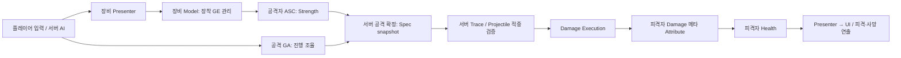

# 플레이어·적 공통 Strength 전투 설계안

> 최종 구현, 삭제된 구형 경로, 빌드·테스트 결과는 [구현 및 에디터 가이드](Strength_Combat_Implementation_and_Editor_Guide.md)를 참조한다. 이 문서는 구현 전의 설계 기준과 판단 근거를 보존한다.

작성일: 2026-09-12. 현재 C++ 소스와 기존 Strength 설정 가이드를 조사한 설계 문서이며, 아래 신규 클래스와 변경 사항은 구현 제안이다. BP 에셋 내부 설정 및 네트워크 실행 결과는 이번 조사에서 검증하지 않았다.

## 1. 목표와 결정 사항

MVP는 **Model–View–Presenter**로 사용한다. GAS의 상태·규칙을 Model에 두고, 장착과 공격의 진행을 Presenter가 조율하며, View는 확정 상태와 연출 이벤트를 표시한다. 모든 클래스를 세 종류의 상속 트리로 강제하지 않고 역할과 의존성으로 구분한다.

핵심 흐름:



- 플레이어와 적 모두 같은 Strength GE, Damage Execution, Damage 메타 Attribute를 사용한다.
- 무기의 StrengthBonus는 **실제 활성 장착 상태**에서만 적용한다. 인벤토리 보유 또는 등 뒤 수납 상태에서는 적용하지 않는다.
- 기본 Strength는 기존 값 10을 유지한다. 무기만으로 Strength를 얻는 규칙을 원할 경우 초기화 GE에서 0으로 설정한다. 이는 데이터 정책이며 계산 구조는 동일하다.
- 직접 무기 피해는 공격 확정 시점의 Source Strength를 사용한다. 원거리 공격은 발사 확정 시점이다.
- 초기 단계에서는 현재 최소 피해 1 정책을 유지한다. 무기 없음·무적·아군 등 공격 무효 조건은 계산 전에 차단한다.
- 공격 중에는 무기 교체를 거부한다. 이미 발사된 화살은 이후 교체와 무관하게 발사 시점 피해를 유지한다.
- 함정·환경·선박 충돌의 고정 피해는 별도 정책으로 유지할 수 있다. 캐릭터의 무기 공격만 이 공통 경로로 통합한다.

## 2. 현재 구현과 차이

| 현재 클래스 / 파일 | 확인한 구현 | 필요한 조치 |
|---|---|---|
| `GASCore/.../BaseAttributeSet.cpp` | Strength 기본 10 및 복제, Damage 소모 후 Health 감소, 무적 태그에 의한 Damage 거부 | 재사용. 전투 연출 제어 책임은 분리 |
| `UGASStrengthEquipmentGameplayEffect` | Infinite / Strength Additive / `Data.StrengthBonus` | 플레이어·적 공통 장착 GE로 유지 |
| `ABaseItem` | StrengthBonus와 적용 ASC·GE Handle을 보유 | 수치 정의는 유지하고 효과 수명 관리는 공통 장비 Model로 이전 |
| `UPlayerEquipmentComponent` | 서버 장착 완료 시 Item에 Strength GE 적용, 해제 시 제거 | 장착 트랜잭션과 공통 Model 호출로 변경 |
| `UGASAttributeDamageExecution` | Source Strength snapshot과 계수를 계산해 Damage 출력 | 최종 공식의 유일한 실행 지점으로 사용 |
| `UGASCombatLibrary` | Strength 공식 사전 계산 및 `Data.Damage` 호환, Execution 계수도 전달 | 구형 GE 호환 경로를 분리하고 공식 중복 제거 |
| `UGA_PlayerBasicAttack` | Strength Spec 생성. 현재 활성화 준비 단계에서 캐시 | 서버 Commit 성공 후 각 타격 확정 시 생성하도록 정리 |
| `UGA_BowAimFire`, `UGA_RangedEnemyAttack` | 공통 Strength Spec 생성 경로 호출 | 유지하되 장착 Strength·발사 시점·서버 입력 검증 확인 |
| `UWeaponDataAsset::FWeaponCombatData` | DamageEffectClass, 몽타주, 사거리 등. StrengthBonus/AttackCoefficient 없음 | 공통 스탯 정의를 적 무기 데이터에 추가 |
| `UBaseWeaponComponent` | 서버 장착·수납·사망·풀링 관리. Strength 효과 적용 없음 | 각 수명 전이에 공통 장비 Model 연결 |
| `UGA_BasicAttack` | 적 무기 DamageEffectClass로 직접 MakeOutgoingSpec | 공통 Strength 요청 생성으로 교체 |
| `UBossGameplayAbility::ApplyDamageToTarget` | float Damage를 받는 경로 | 무기 기반 보스 공격은 계수 기반 요청으로 이전 |
| `ABaseWeapon` | 서버 Trace, 윈도우별 중복 제거 및 GE 적용 | 충돌 검출과 피해 적용 책임 분리 |
| `UBaseHealthComponent` | Attribute 구독, 사망 상태 처리와 피격 문맥 관리 | 기존 진입점 재사용. 서버 사망 전이와 표시 어댑터 경계 명확화 |

따라서 현재 상태를 “플레이어와 적의 모든 무기 피해가 이미 통합됨”으로 간주하면 안 된다. 특히 적 근접은 지정된 BP GE의 내용에 따라 피해 방식이 달라질 수 있다.

## 3. 클래스별 책임

### Model: 데이터와 게임 규칙

| 클래스 | 책임 | 맡기지 않을 책임 |
|---|---|---|
| `UBaseAttributeSet` (기존) | Strength/Health 등 상태, 유효 범위, Damage→Health 반영 | 무기 조회, 몽타주 제어, RPC, UI 호출 |
| `UAbilitySystemComponent` (기존) | GE·Ability 적용, Attribute 집계 및 복제 | 무기별 피해 공식 |
| `FWeaponStatDefinition` (신규, ArtisticSWCore) | StrengthBonus 및 안정적 데이터 식별자 | 런타임 GE Handle, 장착 여부 |
| `FAttackDamageDefinition` (신규, ArtisticSWCore) | AttackCoefficient, Damage GE, 공격 태그, 상태이상 정의 | 클라이언트 확정 피해량 |
| `UEquipmentStatComponent` (신규, GASCore) | 슬롯별 장착 보너스 GE 적용/제거, Handle 소유, 멱등성 및 복구 | 인벤토리 검색, 소켓 부착, 몽타주 |
| `UGASStrengthEquipmentGameplayEffect` (기존) | 보너스를 Strength에 Additive 적용 | 장비 교체 진행 |
| `UGASAttributeDamageExecution` (기존) | 캡처 Attribute와 검증된 계수로 최종 Damage 계산 | 충돌 검사, Health 직접 변경, 피격 연출 |
| `UGASCombatLibrary` (기존) | 서버 데이터로 Spec 및 출처 문맥 구성 | 무기 검색, 공격 상태 보유 |
| `UCombatHitResolverComponent` (신규, GASCore) | 공격 세션별 대상 검증·중복 제거·대상별 Spec 적용 | 몽타주 재생, 클라이언트 입력 수신 |

AttributeSet에 현재 포함된 AttackSpeed 변경 시 몽타주 속도 조절은 후속 리팩터링에서 공격 진행 컴포넌트의 Attribute 구독으로 옮긴다. 이번 Strength 통합의 필수 변경과 분리해 진행한다.

### Presenter: 입력과 진행 조율

| 클래스 | 책임 |
|---|---|
| `UPlayerEquipmentComponent` | 슬롯 요청 검증, 인벤토리 조회, 전환 상태, 장착 확정 시 StatComponent 호출 |
| `UBaseWeaponComponent` | 서버 AI 장비 선택, 장착/수납/사망/풀링 전환, 동일 StatComponent 호출 |
| 플레이어·적 공격 GA | 활성화/비용/쿨다운 검증, 공격 데이터 선택, 서버 Commit, Spec 생성 요청, 공격 윈도우와 종료 관리 |
| `UCombatPresentationComponent` (신규, 선택적 점진 분리) | Attribute·확정 피해·사망 상태를 구독해 UI와 연출에 전달. 초기 조회와 구독 해제 처리 |

GA에는 “언제 공격하는가”가 남고, Execution에는 “얼마나 피해를 주는가”가 남는다. 입력 Controller와 BT는 장착·공격 의도만 전달한다. Presenter라는 이름의 래퍼를 기존 GA 위에 불필요하게 추가하지 않는다.

### View: 표시

무기 Mesh, AnimInstance, HealthBar Widget, GameplayCue, WeaponFeedbackComponent는 표시를 담당한다. 무기 Actor 자체는 충돌과 표시가 함께 있는 호스트이므로 전체를 순수 View라고 부르지 않는다. 충돌 컴포넌트는 HitResult를 내보내고, 표시 컴포넌트는 복제 상태를 반영한다.

AnimNotify는 공격 창 시작/종료를 알릴 수 있지만 최종 권한이 아니다. 서버 GA가 현재 공격 세션과 허용된 타이밍을 검사한다. 클라이언트 Notify와 OnRep에서 GE를 적용하지 않는다.

## 4. 스탯 및 피해 데이터

초기 범위는 가산형 보너스만 지원한다.

```text
현재 Strength = 기본 Strength + 활성 무기 StrengthBonus + 기타 가산 버프
RawDamage = max(0, StrengthSnapshot) × AttackCoefficient × ChargeMultiplier
유효 공격 Damage = max(1, RawDamage)
HealthAfter = clamp(HealthBefore - Damage, 0, MaxHealth)
```

| 장착 예시 | 기본 Strength | 무기 보너스 | 현재 Strength | 공격 계수 | 피해 |
|---|---:|---:|---:|---:|---:|
| 검 A | 10 | 5 | 15 | 1.0 | 15 |
| 검 B | 10 | 20 | 30 | 1.0 | 30 |
| 검 B 강공격 | 10 | 20 | 30 | 1.5 | 45 |
| 활 | 10 | 8 | 18 | 1.0, Charge 2.0 | 36 |

강공격·콤보 배율은 공격 정의에 둔다. 활 발사 GA와 Projectile BP가 서로 다른 계수를 소유하지 않도록 공격별 단일 정의를 선택한다. 무기별 기본 공격 정의를 참조하고 보스 패턴도 같은 타입의 공격 정의를 선택한다.

검증 정책: StrengthBonus는 유한한 0 이상 값, 직접 공격 계수는 유한한 양수, ChargeMultiplier는 서버 설정 범위 내 양수여야 한다. NaN/Inf, 캡처 실패, 누락된 필수 Attribute, 범위 밖 입력은 실패로 처리한다. 현재 Execution의 캡처 성공 여부 미확인·기본 계수 fallback은 새 경로에서 엄격히 검증한다. 계수 0으로 공격 비활성을 표현하지 않는다. 현재 최소 피해 정책상 1이 되기 때문이다.

기본 Strength 0이고 무기 미장착이면 무기 공격 GA는 활성화되지 않는다. 맨손 공격을 허용하려면 별도 공격 정의와 최소 피해 정책을 명시한다. 초기화 GE는 Instant로 기본값을 설정하고, 장착 보너스는 Infinite Additive로 적용한다. 지속 Override 초기화 효과가 장비 가산을 덮어쓰지 않도록 에셋을 검사한다.

미래에 방어력을 추가하면 Target Armor는 적중 시 읽도록 캡처하고 Execution만 확장한다. 치명타는 서버에서 결정한다. 아직 구현하지 않은 방어·치명타·배율 집계 규칙을 이번 공식에 암묵적으로 넣지 않는다.

## 5. 장착 효과 수명과 원자성

`UEquipmentStatComponent`는 서버에서 다음 레코드를 슬롯별로 소유한다.

```text
SlotId → { ItemInstanceId, EquipmentRevision, AppliedASC, StrengthGEHandle }
```

아이템 종류 ID와 실제 인벤토리 인스턴스 ID를 구분한다. 같은 종류의 검 두 개도 서로 다른 인스턴스다. GE Handle은 서버 로컬 자원이며 네트워크 식별자로 사용하지 않는다.

장착 처리 순서:

1. 서버가 소유 인벤토리의 슬롯/인스턴스, 장착 가능 상태, 요청 빈도, ASC 초기화 완료를 확인한다.
2. 같은 인스턴스·Revision이 이미 유효하게 적용되어 있으면 성공을 반환하고 GE를 추가하지 않는다.
3. 전환을 잠그고 새 데이터·무기 생성·필수 GE Spec을 사전 검증한다. 비동기 로딩은 확정 단계 이전에 완료한다.
4. 기존 효과를 정확한 Handle로 제거하고 새 효과를 적용한다. 이 구간에서 공격 Commit은 금지한다.
5. 적용 성공 후 장착 인스턴스·Revision·상태를 확정하고 Ability 부여 및 표시 갱신을 수행한다.
6. 실패하면 새 효과를 정리하고 이전 장비/보너스를 복원한다. 복원도 실패하면 비무장 오류 상태로 전환하고 공격을 차단한다. 실패를 성공한 장착으로 복제하지 않는다.

이는 엔진 차원의 GE 트랜잭션 기능을 가정하지 않는다. 서버 전환 가드와 명시적 rollback으로 구현한다. 중간 Attribute delegate는 발생할 수 있으므로 장비 UI는 전환 완료 후 확정 상태를 표시한다.

해제 시 `Strength -= 이전 보너스` 같은 직접 계산을 하지 않는다. 저장한 Handle만 제거하면 다른 버프가 보존된다. 제거 실패 시 살아 있는 ASC에 효과가 남아 있는지 조회하고, 확인 전 Handle을 잃지 않도록 한다. ASC가 소멸한 경우 로컬 레코드를 정리한다.

| 사건 | 처리 |
|---|---|
| 정상 수납/해제 | 공격 종료 → 장착 GE 제거 → Ability 회수 → 수납 확정 |
| 무기 교체 | 전환 가드 + 이전 효과 제거 + 새 효과 적용/실패 복구 |
| 무기 파괴/소유권 이전 | 이전 ASC 효과 제거 후 레코드 정리. 새 소유자에게 별도 적용 |
| 사망 | 신규 공격 차단, 근접 세션 종료, 장착 효과 제거 |
| Enemy 풀 반환 | 타이머·공격 세션·장착 GE·부여 Ability 정리 |
| Enemy 풀 복원 | ASC/초기 스탯 초기화 후 활성 장착 상태에 따라 1회 재적용 |
| 리스폰/ASC 교체 | 이전 ASC 구독·효과 정리, 새 ASC 준비 후 재결합 |

현재 `ABaseItem`의 효과 관리와 신규 Component를 동시에 활성화하지 않는다. 플레이어 전환 시 GE 소유권을 한 번에 이전해야 보너스가 두 번 들어가지 않는다.

## 6. 공격에서 피격까지

1. 플레이어 입력은 GAS 활성화 요청으로, AI 입력은 서버에서 GA 활성화로 들어온다.
2. 서버 GA가 생존·무기·장착 Revision·상태 태그·비용·쿨다운을 검증하고 Commit한다.
3. GA가 서버 무기/공격 정의로 `FStrengthDamageRequest`를 작성한다. 클라이언트 수치 복사는 금지한다.
4. 공통 Library가 공격자 ASC에서 Spec을 생성한다. Execution의 Source Strength snapshot은 **이 생성 순간** 고정된다.
5. 근접은 각 승인된 콤보 타격 시작 시 새 Spec을 만든다. 원거리는 발사 확정 시 만들고 서버 Projectile에 보관한다. 현재 플레이어의 GA 시작 단계 캐싱은 이 정책에 맞게 변경한다.
6. 서버가 공격 창 안에서 Sweep/Trace 또는 Projectile 충돌을 처리한다. 빠른 이동은 이전 위치→현재 위치 구간 Sweep으로 누락을 줄인다.
7. HitResolver가 공격 세션, 대상 생존·ASC·진영·거리/차폐 정책 및 중복을 확인한다. 기본 정책은 자신/아군 공격 금지다.
8. 대상별 Spec을 복사하고 Context도 복제한 뒤 해당 HitResult를 넣는다. 공유 Context를 변경해 여러 대상의 피격 위치가 섞이지 않도록 한다.
9. Execution이 Damage 메타 Attribute를 출력하고 피격자의 AttributeSet이 이를 소모해 Health에 반영한다.
10. 실제 Health 감소에 따라 피격 피드백을 만들고, Health 0 전이는 기존 HealthComponent에서 한 번만 처리한다. 직접 피해가 거부되면 기본 정책상 부가 상태이상도 적용하지 않는다.

중복 키는 서버가 생성한 `(AttackSequenceId, HitWindowId, Target)`이다. 같은 Notify가 중복으로 도착해도 윈도우를 다시 열거나 중복 Set을 초기화하지 않는다. 다음 콤보 타격에서만 새 WindowId를 승인한다. 관통 화살은 해당 Projectile 수명 동안 대상별 1회이며 Projectile 풀 재사용 시 새 발사 ID를 만든다.

공격 취소/무기 파괴/사망에서는 Trace와 타이머를 닫고 Spec과 세션을 해제한다. 발사된 화살은 공격자 사망 후에도 유지하는 정책으로 정하되, Source 문맥과 Attribute snapshot을 보존하고 Source ASC 소멸 상황은 별도 테스트한다. 무기 Actor가 없어도 계산에 필요한 데이터를 다시 조회하지 않는다.

Instant GE의 적용 결과를 지속 효과 Handle 유효성만으로 성공 판정하지 않는다. 실제 피해 처리는 Health 변경 및 효과 적용 문맥을 연결한 확정 이벤트로 판단한다. 여러 피해가 연속 발생할 수 있으므로 일반 Health delegate의 차이만으로 출처를 추정하지 않는다.

## 7. 네트워크 권한과 복제 계약

| 항목 | 클라이언트 | 서버 |
|---|---|---|
| 장착 | 슬롯/인스턴스 선택 요청 | 소유권·가능 상태 검증, 장착 GE 변경 |
| 공격 | 입력·조준 의도, 예측 몽타주 | 활성화/Commit, 계수·Strength·차지 시간 결정 |
| 적중 | 선택적으로 후보 정보 제출 | 충돌 또는 재검증으로 확정 |
| Damage/Health | 확정 결과 표시 | 계산·적용·사망 전이 |
| 공격 연출 | 즉시 로컬 표시 후 보정 | 권한 상태와 확정 피드백 전달 |

- RPC는 소유 Player/복제 Component 경유다. `ServerApplyDamage(Target, Damage)` 같은 임의 피해 RPC를 제공하지 않는다. Enemy에는 클라이언트 장착 RPC를 노출하지 않는다.
- Charge는 서버 시작/종료 시각으로 계산하고 최대 차지·발사 빈도·입력 재전송을 검증한다. 조준 벡터도 유한성, 발사 위치와 허용 방향을 확인한다.
- GA가 ServerOnly여도 공개 피해 진입점·Projectile/Resolver의 실제 적용 함수에 Authority 검사와 유효한 공격 세션 검사를 둔다.
- Strength·Health·MaxHealth는 현재 Attribute 복제를 유지한다. Damage 메타 Attribute, GE Handle, 서버 Spec은 별도 RPC로 복제하지 않는다.
- 장착은 `{Item, State, Revision}`의 논리적 상태를 복제한다. Attribute와 Actor 참조가 같은 패킷 순서로 도착한다고 가정하지 않는다. OnRep는 표시 재시도만 하며 서버 스탯을 재계산하지 않는다.
- 초기 합류 시 Attribute 현재값과 장착/사망 상태를 조회해 View를 초기화한 뒤 변경 구독을 유지한다. 일회성 Cue만으로 지속 상태를 복원하지 않는다.
- 플레이어 LocalPredicted GA는 유지 가능하다. 예측 범위는 입력 반응과 몽타주이며, 피해 Execution/상대 Health는 서버 확정으로 처리한다. 거절 시 몽타주·로컬 공격 상태를 정리하고 예측/서버 Cue 중복을 방지한다.
- Dedicated Server에서 화면에 보이지 않는 캐릭터도 공격 중 몽타주 Notify와 소켓 Pose가 갱신되어야 한다. 기존 `AcquireServerCombatPoseRefresh` 패턴을 적까지 점검하고 서버 타이밍 대안을 마련한다.
- 지연 보상은 초기 범위에 포함하지 않는다. 우선 서버 현재 위치 기준 판정을 사용한다. 이후 필요하면 제한된 시간 범위의 서버 히스토리 재검증을 추가한다.

GAS는 Ability 실행 정책, Attribute, GE 계산을 별도 기능으로 제공한다. 이 설계의 세부 장착 정책·스냅샷 시점·네트워크 입력 계약은 프로젝트 결정이다. 참고: [Epic GAS 구조](https://dev.epicgames.com/documentation/en-us/unreal-engine/understanding-the-unreal-engine-gameplay-ability-system), [Gameplay Effects](https://dev.epicgames.com/documentation/unreal-engine/gameplay-effects-for-the-gameplay-ability-system-in-unreal-engine), [Gameplay Abilities 실행 정책](https://dev.epicgames.com/documentation/unreal-engine/using-gameplay-abilities-in-unreal-engine).

## 8. 모듈 의존성과 이행 순서

현재 GASCore는 ArtisticSWCore를 참조한다. 순환 참조를 만들지 않도록 공통 데이터 구조는 ArtisticSWCore, Attribute를 아는 서비스는 GASCore, 플레이어/적 어댑터는 ClassFeature/Enemy에 둔다. ArtisticSWCore의 Item Actor가 신규 GASCore Component를 직접 include하지 않고 상위 장비 Component가 연결한다.

1. **장착 Model 통합:** 공통 데이터와 EquipmentStatComponent 구현, 플레이어 Handle 소유권 이전, 적 장착/수납/풀링 경로 연결.
2. **무기 피해 통합:** 적 GA·무기 기반 보스 공격을 Strength Request로 변경. 모든 무기 직접 피해 GE는 Execution 경로로 이전.
3. **시점 및 검증 통일:** Commit 이후 타격별 Spec 생성, 공통 HitResolver, 세션 ID·중복·권한·진영 검증.
4. **표시 책임 정리:** 서버 확정 피격 이벤트와 UI 구독 연결, AttributeSet의 몽타주 제어 분리.
5. **에셋 이행:** 검·활·적 무기·보스 공격 정의에 StrengthBonus/계수 설정. 직접 피해 GE에 Execution과 Data.Damage Modifier가 동시에 있는지 검사한다. 동시 사용은 이중 피해이므로 오류 처리한다.
6. **구형 경로 정리:** 기존 `Data.Damage` GE는 명시적 호환 어댑터로 격리한다. 전환 완료 후 무기 공격에서 제거하고 환경 피해 용도만 남긴다. `AttackPower`, `BaseDamage` 등은 BP 참조 검사 후 단계적으로 폐기한다.

새 경로 Library는 최종 피해를 사전 계산하지 않고 계수와 Context만 구성한다. 호환 기간에 사전 계산이 필요하면 Execution과 같은 순수 계산 함수를 사용하되 구형 GE에서만 사용한다. 기존 에셋의 고정 피해를 계수로 변환할 때는 기준 Strength를 정하고 `기존 피해 / 기준 Strength`로 초기 이행값을 산출한 뒤 밸런스를 확인한다.

## 9. 검증 및 완료 기준

| 구분 | 시나리오 | 기대 결과 |
|---|---|---|
| 장착 | 기본 10, 검 +5 → 검 +20 → 수납 | 15 → 30 → 10 |
| 멱등성 | 같은 장착 요청 반복·중복 Notify | 보너스/타격 창 중복 생성 없음 |
| 버프 보존 | 기본 10 + 버프 7 + 무기 5 후 무기 제거 | 17 유지 |
| 실패 복구 | 새 GE 적용 실패, 이전 GE 제거 실패 | 일관된 이전 상태 복구 또는 공격 차단 |
| 양방향 피해 | Player→Enemy 및 Enemy→Player, Strength 30·계수 1.5 | 양쪽 모두 Damage 45 |
| Snapshot | Strength 15로 화살 발사 후 30 무기 장착 | 기존 화살 피해 15, 다음 화살 30 |
| 콤보 | 첫 타격 후 Strength 변경 | 승인된 다음 타격의 새 Snapshot에 반영 |
| 중복 | 여러 충돌 컴포넌트·중복 이벤트·관통 재접촉 | 공격 윈도우/발사당 대상별 1회 |
| 피해 거부 | 아군·자기 자신·무적·사망 대상 | Health 감소 및 성공 피격 피드백 없음 |
| 경계 입력 | NaN/Inf, 누락 Attribute, 비정상 계수 | 적용 거부 및 원인 로그 |
| 치명타격 | 여러 공격이 같은 프레임에 치명 피해 | Health 0, 사망 전이 1회 |
| 수명 | 파괴·소유권 이전·사망·풀 반환/복원·ASC 교체 | 잔존 GE·중복 보너스·타이머 없음 |
| 네트워크 | Dedicated Server + 2 Clients, 지연/패킷 손실 | 서버 수치 수렴, 클라이언트 단독 피해 없음 |
| 예측 거절 | 장착/공격 상태 불일치 | 서버 피해 없음, 로컬 몽타주·상태 복구 |
| 초기 복원 | 늦은 합류·관련성 재진입 | 올바른 체력·장착·사망 표시 |
| 서버 애니메이션 | 비가시/전용 서버 캐릭터 근접 공격 | Trace 소켓·Notify가 정상 동작 |

기존 `ArtisticSW.GAS.Strength`, `ArtisticSW.Enemy.RangedEnemy` 테스트 및 StrengthMeleeTests를 재사용·확장한다. 이번 문서 작성에서는 테스트를 실행하지 않았다. 완료는 C++ 컴파일·자동화 테스트·실제 BP 에셋 검사·Dedicated Server 양방향 피해 검증까지 통과했을 때로 정의한다.

진단 로그에는 AttackSequenceId, WindowId, EquipmentRevision, Source/Target, StrengthSnapshot, 계수, Health 전후, 거부 사유를 남긴다. 상세 로그는 디버그 옵션으로 제한한다.

현재 설정 가이드: [Strength 전투 구현 및 에디터 설정](Strength_Combat_Implementation_and_Editor_Guide.md). 이전 문서 경로는 최신 가이드로 연결하는 안내만 유지한다.
